# Kubernetes: A Complete Guide

## Table of Contents

<!-- TOC -->
* [Kubernetes: A Complete Guide](#kubernetes-a-complete-guide)
  * [Table of Contents](#table-of-contents)
  * [Section 1: Why Kubernetes? The Problem with Docker Alone](#section-1-why-kubernetes-the-problem-with-docker-alone)
    * [What Docker Does Well](#what-docker-does-well)
    * [Where Docker Falls Short in Production](#where-docker-falls-short-in-production)
    * [The Core Problems](#the-core-problems)
  * [Section 2: What is Kubernetes?](#section-2-what-is-kubernetes)
    * [What Kubernetes Does](#what-kubernetes-does)
    * [Key Capabilities](#key-capabilities)
  * [Section 3: Kubernetes Architecture](#section-3-kubernetes-architecture)
    * [The Big Picture](#the-big-picture)
    * [Control Plane Node](#control-plane-node)
    * [Worker Node](#worker-node)
    * [Full Architecture Diagram](#full-architecture-diagram)
    * [Deploying an App to Kubernetes](#deploying-an-app-to-kubernetes)
  * [Section 4: Setting Up Kubernetes Locally](#section-4-setting-up-kubernetes-locally)
    * [Local Kubernetes Options](#local-kubernetes-options)
    * [Why Minikube?](#why-minikube)
    * [Minikube Architecture](#minikube-architecture)
    * [Minikube vs Production Cluster](#minikube-vs-production-cluster)
    * [Install Minikube on Mac](#install-minikube-on-mac)
    * [Troubleshooting (Apple Silicon: M1/M2/M3)](#troubleshooting-apple-silicon-m1m2m3)
    * [Install Minikube on Windows](#install-minikube-on-windows)
    * [Starting Minikube](#starting-minikube)
    * [Update Minikube](#update-minikube)
    * [Uninstall Minikube](#uninstall-minikube)
  * [Section 5: kubectl — Your Command-Line Interface to Kubernetes](#section-5-kubectl--your-command-line-interface-to-kubernetes)
    * [What is kubectl and Why Do You Need It?](#what-is-kubectl-and-why-do-you-need-it)
    * [How kubectl Works Under the Hood](#how-kubectl-works-under-the-hood)
    * [Install kubectl on Mac](#install-kubectl-on-mac)
    * [Install kubectl on Windows](#install-kubectl-on-windows)
    * [Uninstall kubectl](#uninstall-kubectl)
    * [Essential kubectl Commands](#essential-kubectl-commands)
    * [Minikube Dashboard](#minikube-dashboard)
  * [Section 6: Building Blocks — What We Are Going to Implement](#section-6-building-blocks--what-we-are-going-to-implement)
    * [How They Interact](#how-they-interact)
  * [Section 6: Deploying the library-events-producer App](#section-6-deploying-the-library-events-producer-app)
    * [What is a Deployment?](#what-is-a-deployment)
    * [The Deployment Manifest](#the-deployment-manifest)
    * [Manifest Field Breakdown](#manifest-field-breakdown)
    * [What is a Pod?](#what-is-a-pod)
    * [Apply the Deployment](#apply-the-deployment)
    * [Self-Healing in Action](#self-healing-in-action)
  * [Section 7: Exposing the library-events-producer App](#section-7-exposing-the-library-events-producer-app)
    * [The Problem with Pods Alone](#the-problem-with-pods-alone)
    * [What is a Service?](#what-is-a-service)
    * [Service Manifest](#service-manifest)
    * [Accessing the App on Minikube](#accessing-the-app-on-minikube)
    * [Option 2 — kubectl port-forward](#option-2--kubectl-port-forward)
    * [Option 3 — Ingress](#option-3--ingress)
    * [Quick Reference — Launch and Test Commands](#quick-reference--launch-and-test-commands)
      * [Option 1 — minikube service (NodePort tunnel)](#option-1--minikube-service-nodeport-tunnel)
      * [Option 2 — kubectl port-forward](#option-2--kubectl-port-forward-1)
      * [Option 3 — Ingress](#option-3--ingress-1)
  * [Section 8: Scaling to Multiple Replicas](#section-8-scaling-to-multiple-replicas)
    * [Why Scale?](#why-scale)
    * [What Kubernetes Does When You Scale](#what-kubernetes-does-when-you-scale)
    * [Scaling the Deployment](#scaling-the-deployment)
    * [How the Service Routes Traffic Across 3 Replicas](#how-the-service-routes-traffic-across-3-replicas)
    * [Scale Back Down](#scale-back-down)
  * [Section 9: ConfigMaps — Decoupling Configuration from Code](#section-9-configmaps--decoupling-configuration-from-code)
    * [The Problem with Hardcoded Config](#the-problem-with-hardcoded-config)
    * [What is a ConfigMap?](#what-is-a-configmap)
    * [The ConfigMap Manifest](#the-configmap-manifest)
    * [The Updated Deployment — v3](#the-updated-deployment--v3)
    * [How ConfigMap Keys Become Environment Variables](#how-configmap-keys-become-environment-variables)
    * [Apply the ConfigMap and Deploy](#apply-the-configmap-and-deploy)
    * [Does a ConfigMap Change Require Redeployment?](#does-a-configmap-change-require-redeployment)
  * [Section 10: Liveness and Readiness Probes](#section-10-liveness-and-readiness-probes)
    * [The Problem Without Probes](#the-problem-without-probes)
    * [What is a Liveness Probe?](#what-is-a-liveness-probe)
    * [What is a Readiness Probe?](#what-is-a-readiness-probe)
    * [Liveness vs Readiness — Side by Side](#liveness-vs-readiness--side-by-side)
    * [How They Work Together](#how-they-work-together)
    * [Deployment v4 — With Liveness and Readiness Probes](#deployment-v4--with-liveness-and-readiness-probes)
  * [Library Events Producer — Quick Setup & Teardown](#library-events-producer--quick-setup--teardown)
    * [Setup](#setup)
    * [Teardown](#teardown)
  * [Section 11: Library Events Consumer](#section-10-library-events-consumer)
    * [ConfigMap](#configmap)
    * [Deployment](#deployment)
    * [Service](#service)
    * [Ingress](#ingress)
    * [Apply — Step by Step](#apply--step-by-step)
    * [Access via Ingress](#access-via-ingress)
    * [Delete All](#delete-all)
<!-- TOC -->

---

## Section 1: Why Kubernetes? The Problem with Docker Alone


### What Docker Does Well

Docker revolutionized the way we package and run applications. With Docker you can:

- **Package** your application and all its dependencies into a container image
- **Run** that container consistently on any machine — your laptop, a colleague's machine, or a server
- **Isolate** processes so they do not interfere with each other

A single `docker run` command is all you need to get an app running. For local development and simple deployments, Docker is fantastic.

---

### Where Docker Falls Short in Production

The moment you move beyond a single machine or a single container, Docker alone starts to show its limits.

Consider a real-world scenario: you have a Spring Boot application packaged as a Docker container. It works perfectly on your laptop. Now you need to deploy it to production where it must:

- Handle thousands of requests per second
- Stay online 24/7 — even when a server crashes
- Scale up during peak traffic and scale back down to save costs
- Roll out new versions without any downtime
- Recover automatically when the app crashes

Docker alone cannot do any of these things reliably.

---

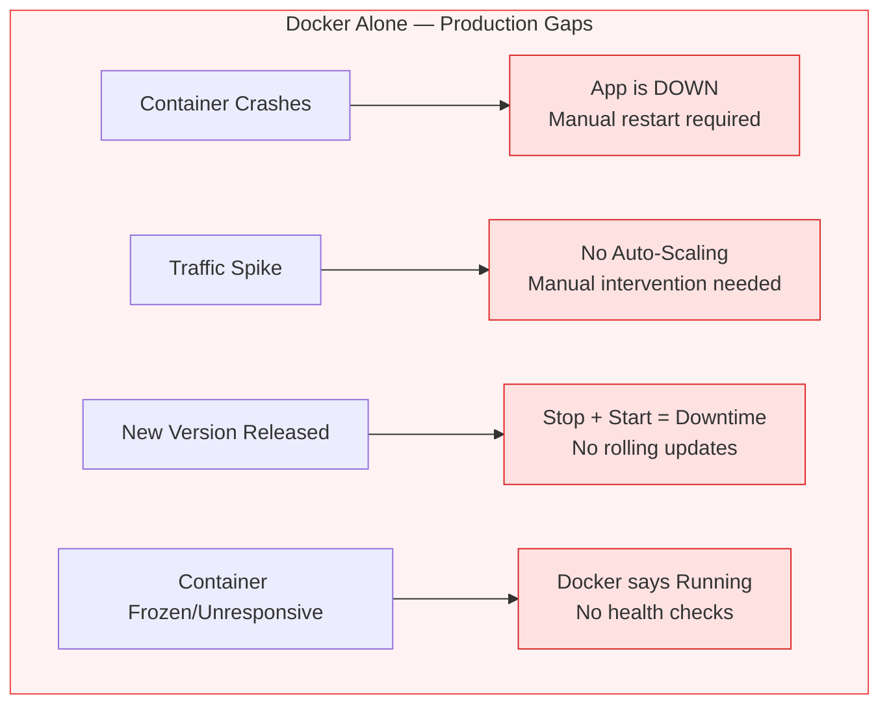

### The Core Problems


| # | Problem | Trigger | What Docker does | Impact |
|---|---|---|---|---|
| 1 | **No automatic recovery** | Container crashes | Nothing — the process is dead | App is down until someone manually restarts it |
| 2 | **No built-in scaling** | Traffic spikes | Nothing — no auto-scale mechanism | You must manually run more `docker run` commands |
| 3 | **No load balancing** | Multiple containers running | Nothing — Docker has no traffic distribution | Requests pile up on one container; others sit idle |
| 4 | **No rolling updates** | New version released | Stop old container, start new one | Downtime between stop and start |
| 5 | **No health management** | App freezes inside container | Reports the container as `running` | Broken app keeps receiving traffic; no automatic restart |


> **The bottom line:** Docker solves the *packaging* and *portability* problem. Kubernetes solves the *running at scale, reliably, in production* problem.

---

## Section 2: What is Kubernetes?

Kubernetes (often abbreviated as **K8s**) is an open-source **container orchestration platform** originally developed by Google, and now maintained by the Cloud Native Computing Foundation (CNCF).

In plain terms: **Kubernetes manages your containers so you don't have to.**

You tell Kubernetes *what* you want and it continuously works to make that a reality:

- **Declare your intent** — "run 3 copies of my application, keep them healthy, and distribute traffic evenly"
- **Container crashes?** — Kubernetes automatically restarts it
- **Node dies?** — Kubernetes reschedules your workloads on a healthy node
- **Traffic increases?** — Kubernetes scales your app up automatically

---

### What Kubernetes Does

| Capability | What it means for you |
|---|---|
| **Self-healing** | Crashed containers are automatically restarted. Failed nodes cause pods to be rescheduled elsewhere. |
| **Auto-scaling** | Kubernetes can automatically add or remove instances of your app based on CPU/memory usage or custom metrics. |
| **Rolling updates** | Deploy a new version of your app with zero downtime — Kubernetes gradually replaces old pods with new ones. |
| **Load balancing** | Incoming traffic is automatically distributed across all healthy instances of your app. |
| **Service discovery** | Containers can find and talk to each other by name — no need to hardcode IP addresses. |
| **Storage orchestration** | Automatically mounts the storage system of your choice (local disk, cloud storage, etc.). |
| **Configuration management** | Secrets and configuration are kept separate from container images, making them easy to update. |

---

### Key Capabilities

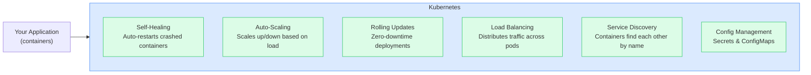

---

## Section 3: Kubernetes Architecture

A Kubernetes cluster is made up of two distinct types of machines working together: the **Control Plane** (the brain) and **Worker Nodes** (the muscles).

### The Big Picture

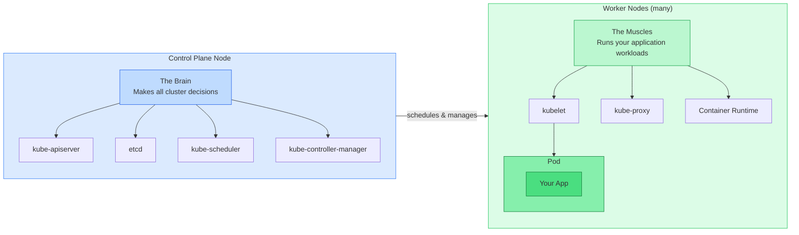

---

### Control Plane Node

The control plane is the brain of the cluster. It makes all the decisions — what runs where, how many copies, what to do when something fails.

| Component | What it does |
|---|---|
| `kube-apiserver` | The front door to the cluster. All communication (kubectl, controllers, kubelets) goes through it |
| `etcd` | The cluster database. Stores all object state (Deployments, Pods, Services, etc.) persistently |
| `kube-scheduler` | Watches for new Pods with no assigned node and picks the best node to run them on |
| `kube-controller-manager` | Runs all built-in controllers (Deployment, ReplicaSet, Node, etc.) in a single process |

---

### Worker Node

Worker nodes are where your application containers actually run. Each worker node has three core components:

| Component | What it does |
|---|---|
| `kubelet` | Agent on every node. Receives Pod assignments from the API server and instructs the container runtime to start/stop containers |
| `kube-proxy` | Manages network rules on each node so that Service IPs route correctly to the right Pods |
| Container runtime | The engine that actually runs containers (e.g. `containerd`). kubelet talks to it via the CRI (Container Runtime Interface) |

---

### Full Architecture Diagram

The images below show each plane in detail. The mermaid diagram that follows brings them together, showing how every component connects and communicates at runtime.


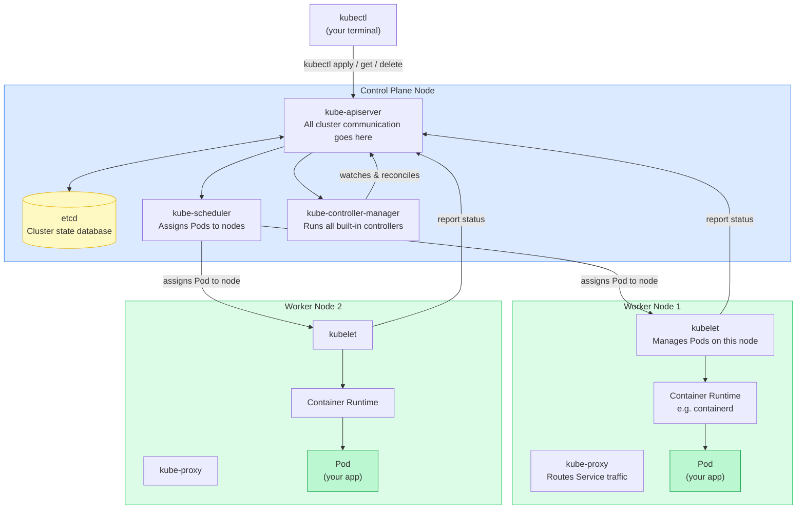

A Kubernetes cluster is divided into two planes with clearly separated responsibilities:

**Control Plane** — the decision-making center:
- Never runs your application directly — its sole job is to watch the desired state you declare and issue instructions to make it a reality
- `kube-apiserver` is the single entry point for all communication — kubectl, controllers, and kubelets all talk exclusively through it
- `etcd` is the cluster's persistent memory — every object and its current state is stored here
- `kube-scheduler` watches for new Pods with no assigned node and picks the most suitable worker node for them
- `kube-controller-manager` runs control loops (Deployment, ReplicaSet, Node controllers, etc.) that continuously reconcile actual state with desired state

**Worker Nodes** — the execution layer:
- Where your application containers actually run
- `kubelet` on each node receives Pod assignments from the API server and drives the container runtime to start, stop, or restart containers
- `kube-proxy` maintains network rules so that Service IPs correctly route traffic to the right Pod endpoints
- Container runtime (typically `containerd`) is the low-level engine that pulls images and runs containers

**Key design principle:**
- The two planes communicate exclusively through the API server — no component ever talks to `etcd` or to another component directly, keeping the architecture consistent, auditable, and easy to reason about

---

### Deploying an App to Kubernetes

Once the cluster is running, deploying an application follows a well-defined path through the architecture. Every step below is driven by one of the components you just learned about.


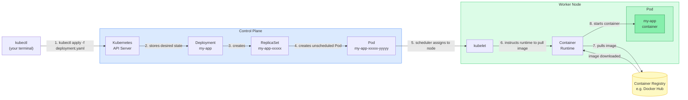

**Step-by-step walkthrough:**

1. **You run `kubectl apply -f deployment.yaml`** — kubectl reads your manifest and sends it as an HTTP request to the `kube-apiserver`.
2. **API server stores the desired state** — the Deployment object is written to `etcd`. From this moment on, the cluster knows what you want.
3. **Deployment controller creates a ReplicaSet** — the `kube-controller-manager` detects the new Deployment and creates a ReplicaSet to manage the desired number of Pod replicas.
4. **ReplicaSet controller creates Pods** — the ReplicaSet controller finds that 0 Pods exist but 1 (or more) are desired, so it creates Pod objects in `etcd`. These Pods are not yet assigned to any node.
5. **Scheduler assigns the Pod to a node** — the `kube-scheduler` watches for unscheduled Pods, evaluates all available nodes (checking resources, taints, affinity rules), and writes the chosen node name into the Pod object.
6. **kubelet picks up the assignment** — the `kubelet` on the selected worker node watches the API server for Pods assigned to its node and immediately begins acting on the new assignment.
7. **Image is pulled** — kubelet instructs the container runtime to pull the specified image from the container registry (e.g. Docker Hub).
8. **Container starts** — the runtime starts the container inside the Pod. The kubelet reports the Pod's status (Pending → Running) back to the API server, and `etcd` is updated to reflect reality.

> The whole sequence — from `kubectl apply` to a running container — typically completes in a few seconds for a pre-pulled image, or slightly longer if the image needs to be pulled for the first time.

---

## Section 4: Setting Up Kubernetes Locally

We will run Kubernetes locally — setting up the cluster on your machine, deploying the app, and running it end to end without any cloud provider. Several tools make this possible:

### Local Kubernetes Options

| Tool | Description | Best For |
|---|---|---|
| **Minikube** | Runs a single-node Kubernetes cluster inside a VM or Docker container. Official Kubernetes project. | Beginners, local dev, learning |
| **kind** (Kubernetes in Docker) | Runs Kubernetes clusters using Docker containers as nodes. Very fast to spin up. | CI/CD pipelines, multi-node local testing |
| **k3s** | A lightweight Kubernetes distribution by Rancher. Minimal resource requirements. | Edge/IoT, low-resource machines, quick setup |
| **Docker Desktop** | Includes a built-in Kubernetes option you can enable with a checkbox. | Developers already using Docker Desktop on Mac/Windows |
| **MicroK8s** | Lightweight Kubernetes by Canonical (Ubuntu). Snap-based install. | Linux users, Ubuntu-based environments |

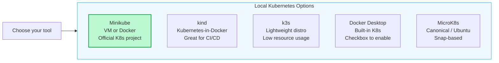

---

### Why Minikube?

We will use **Minikube** as our local Kubernetes environment. Here is why it stands out for learning:

| Advantage | Detail |
|---|---|
| **Official Kubernetes project** | Maintained by the Kubernetes SIGs (Special Interest Groups) — it stays current with Kubernetes releases |
| **Multiple driver support** | Runs on Docker, VirtualBox, HyperKit, VMware, and more — works on Mac, Windows, and Linux |
| **Add-ons ecosystem** | One command enables Ingress, Dashboard, metrics-server, registry, and more |
| **Built-in dashboard** | `minikube dashboard` gives you a visual UI out of the box |
| **Easy to start/stop** | `minikube start` and `minikube stop` — no complex setup |
| **kubectl integration** | Automatically configures kubectl to point at your local cluster |
| **Port forwarding & tunnel** | `minikube service` and `minikube tunnel` make it easy to access your apps locally |
| **Designed for learning** | Rich documentation, large community, beginner-friendly |

---

### Minikube Architecture

Minikube runs a local Kubernetes cluster as either:

- a **VM** (using drivers like HyperKit, VirtualBox, VMware, etc.), or
- a **container** (using the Docker driver)

Inside that VM or container, Minikube bootstraps a full (single-node) Kubernetes cluster — including both the control plane components and the worker node components.

**Driver choice for this guide — Docker:**

Since we already have Docker running on our machine, we will use the **Docker driver**. This means Minikube will spin up the Kubernetes node as a Docker container rather than a full VM — no extra virtualisation software needed. It is the fastest way to get started and works consistently across Mac, Windows, and Linux.

```shell
minikube config set driver docker
minikube start
```

---

### Minikube vs Production Cluster

In a real cluster, the control plane and worker nodes are **separate machines**. Minikube collapses both into a **single node** — the same VM or container runs both the control plane components and the kubelet/kube-proxy that execute your workloads. This is purely a local development trade-off to keep resource usage low.

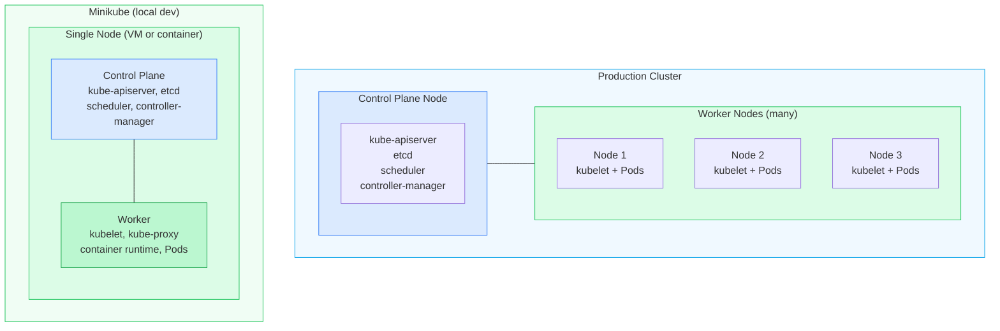

> Minikube is designed for learning and local development only. Never use it for production — there is no fault tolerance, and the single node is both a single point of failure and a resource bottleneck.

---

---

### Install Minikube on Mac

```shell
brew install minikube
```

**Verify the installation:**

```shell
minikube version
```

---

### Troubleshooting (Apple Silicon: M1/M2/M3)

If you see this warning while running `minikube start`:

- `You are trying to run the amd64 binary on an M1 system`
- `Unable to pick a default driver`

It means your current `minikube` binary is x86_64 (`amd64`) and needs to be replaced with the arm64 binary.

**Check current binary architecture:**

```shell
which minikube
file "$(which minikube)"
```

If the output shows `x86_64`, install the arm64 binary:

```shell
cd /tmp
curl -LO https://github.com/kubernetes/minikube/releases/download/v1.38.1/minikube-darwin-arm64
chmod +x minikube-darwin-arm64
sudo install minikube-darwin-arm64 /usr/local/bin/minikube
```

**Verify:**

```shell
file /usr/local/bin/minikube
minikube version
```

**Set the driver and start Minikube (Docker driver):**

```shell
minikube config set driver docker
minikube config get driver
minikube start
```

**Optional checks:**

```shell
minikube profile list
kubectl config current-context
```

> Note: `Error: specified key could not be found in config` for `minikube config get driver` means no default driver has been set yet — this is expected on a fresh install.

---

### Install Minikube on Windows

If the [Chocolatey Package Manager](https://chocolatey.org/) is installed, use:

```shell
choco install minikube
```

> For other installation methods on Windows (winget, installer binary, etc.), refer to the [official Minikube documentation](https://minikube.sigs.k8s.io/docs/start/).

---

### Starting Minikube

```shell
# Start with the default driver
minikube start

# Start with a specific driver
minikube start --driver=docker

# Stop the cluster
minikube stop

# Delete the cluster (full reset)
minikube delete

# Check cluster status
minikube status
```

---

### Update Minikube

**Mac (Homebrew)**

```shell
brew upgrade minikube
```

**Windows (Chocolatey)**

```shell
choco upgrade minikube
```

**Manual update (any platform — replace version as needed)**

```shell
# Check current version
minikube version

# Download and install the latest binary (Mac arm64 example)
cd /tmp
curl -LO https://github.com/kubernetes/minikube/releases/latest/download/minikube-darwin-arm64
chmod +x minikube-darwin-arm64
sudo install minikube-darwin-arm64 /usr/local/bin/minikube

# Verify
minikube version
```

> After updating, run `minikube delete` followed by `minikube start` to recreate the cluster with the new version. Updating the binary alone does not upgrade the cluster node.

---

### Uninstall Minikube

Before uninstalling, delete the cluster and clean up its data:

```shell
# 1. Stop the running cluster
minikube stop

# 2. Delete the cluster and all its data
minikube delete --all --purge
```

**Mac (Homebrew)**

```shell
brew uninstall minikube

# Remove leftover config and data
rm -rf ~/.minikube
rm -rf ~/.kube
```

> If `minikube` still responds after the steps above, a manually installed binary is still present on your PATH. Find and remove it:
> ```shell
> which minikube          # likely /usr/local/bin/minikube
> sudo rm /usr/local/bin/minikube
> which minikube          # should now return: command not found
> ```

**Windows (Chocolatey)**

```shell
choco uninstall minikube
```

Then manually delete the leftover directories:
- `C:\Users\<your-user>\.minikube`
- `C:\Users\<your-user>\.kube`

**Manual removal (binary installed manually)**

```shell
sudo rm /usr/local/bin/minikube
rm -rf ~/.minikube
rm -rf ~/.kube
```

> `~/.kube` contains your kubeconfig file. Only delete it if you have no other clusters configured, or back it up first.

---

## Section 5: kubectl — Your Command-Line Interface to Kubernetes

### What is kubectl and Why Do You Need It?

Imagine Kubernetes is a large factory floor full of machines running your applications. You, as the developer or operator, need a way to talk to that factory — to tell it what to run, check if things are working, and fix problems when they arise.

**kubectl is that communication tool.** It is the official command-line interface (CLI) for Kubernetes. Every time you want to interact with a Kubernetes cluster — whether it is running locally on your laptop (Minikube) or in the cloud (GKE, EKS, AKS) — you use kubectl.

**Without kubectl, you have no way to:**
- See what is running inside your cluster
- Deploy your application
- Check logs when something breaks
- Scale your app up or down
- Connect to a running container to debug it

**A simple analogy:**
Think of Kubernetes as a restaurant kitchen and kubectl as the order slip system. The kitchen (cluster) does all the work, but you need the order slip system (kubectl) to communicate what you want done. Without it, the kitchen has no idea what to cook.

> In short: kubectl is to Kubernetes what a TV remote is to a television. You technically could operate without it, but you really do not want to.

---

### How kubectl Works Under the Hood

kubectl talks to the Kubernetes API server — the brain of the cluster. Every command you type is translated into an HTTP API call, and the cluster responds with the current state.

```text
You (terminal)
    |
    | kubectl get pods
    v
kubectl CLI  -->  Kubernetes API Server  -->  Returns list of running pods
```

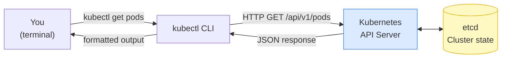

kubectl reads its configuration from `~/.kube/config` (the **kubeconfig** file). This file stores the addresses and credentials for every cluster you have access to. When you run `minikube start`, Minikube automatically adds a `minikube` context to this file so kubectl knows how to reach your local cluster.

---

### Install kubectl on Mac

kubectl is the command-line tool used to interact with any Kubernetes cluster (Minikube, GKE, EKS, etc.).

**Option 1 — Via Homebrew (recommended)**

```shell
brew install kubectl
```

**Option 2 — Manual binary install (Apple Silicon)**

```shell
# Download the arm64 binary
curl -LO "https://dl.k8s.io/release/$(curl -Ls https://dl.k8s.io/release/stable.txt)/bin/darwin/arm64/kubectl"

# Make it executable and move to PATH
chmod +x kubectl
sudo mv kubectl /usr/local/bin/kubectl
```

**Verify installation**

```shell
kubectl version --client
kubectl version --client --output=yaml
```

---

### Install kubectl on Windows

**Option 1 — Via Chocolatey**

```shell
choco install kubernetes-cli
```

**Option 2 — Via winget**

```shell
winget install -e --id Kubernetes.kubectl
```

**Verify installation**

```shell
kubectl version --client
```

---

### Uninstall kubectl

**Mac (Homebrew)**

```shell
brew uninstall kubectl

# Remove leftover config
rm -rf ~/.kube
```

> If `kubectl` still responds after the above, a manually installed binary is present. Find and remove it:
> ```shell
> which kubectl           # likely /usr/local/bin/kubectl
> sudo rm /usr/local/bin/kubectl
> which kubectl           # should now return: command not found
> ```

**Windows (Chocolatey)**

```shell
choco uninstall kubernetes-cli
```

**Windows (winget)**

```shell
winget uninstall -e --id Kubernetes.kubectl
```

Then manually delete the leftover config directory:
- `C:\Users\<your-user>\.kube`

---

### Essential kubectl Commands

```shell
# Cluster & context
kubectl get nodes                          # List all nodes in the cluster
kubectl config get-contexts                # List all configured clusters
kubectl config current-context             # Show active cluster context
kubectl config use-context <context-name>  # Switch to a different cluster

# Namespaces
kubectl get namespaces                     # List namespaces
kubectl get pods -A                        # List all pods across all namespaces

# Deploying & managing resources
kubectl apply -f <file.yaml>               # Deploy a resource from a YAML file
kubectl delete -f <file.yaml>              # Remove a resource
kubectl get deployments                    # List all deployments
kubectl get pods                           # List pods in the current namespace

# Debugging
kubectl logs <pod-name>                    # View pod logs
kubectl describe pod <pod-name>            # Detailed pod info and events
kubectl exec -it <pod-name> -- /bin/bash   # Shell into a running pod
```

---

### Minikube Dashboard

The Minikube dashboard is a built-in web UI that gives you a visual overview of everything running inside your cluster. Instead of typing kubectl commands, you can browse your pods, deployments, services, and logs directly in the browser.

It is especially useful for beginners — you can see the state of your cluster at a glance without needing to memorize commands.

**Launch the dashboard:**

```shell
minikube dashboard
```

This command will:
1. Enable the dashboard addon if it is not already enabled
2. Start a local proxy to the Kubernetes API
3. Automatically open the dashboard in your default browser

> Note: The dashboard only runs while the command is active in your terminal. Closing the terminal or pressing `Ctrl+C` will stop it.

---

---

## Section 6: Building Blocks — What We Are Going to Implement

To run the `library-events-producer` Spring Boot app in Kubernetes, we will build up a set of components one by one. Each component has a specific responsibility, and together they form a complete, production-like deployment.

| Component | What it is | What it does in our app |
|---|---|---|
| **Deployment** | Manages the desired state of your app | Ensures 1 replica of `library-events-producer` is always running |
| **Pod** | The smallest deployable unit | Wraps the `library-events-producer` container and gives it a network identity |
| **Service** | Stable network endpoint | Exposes the app so it can be reached consistently, regardless of Pod restarts |
| **ConfigMap** | Stores non-sensitive configuration | Holds environment-specific settings like Kafka bootstrap server address |
| **Secret** | Stores sensitive configuration | Holds credentials and sensitive values, base64-encoded |
| **ReplicaSet** | Created automatically by the Deployment | Maintains the exact number of Pod replicas at all times |

### How They Interact

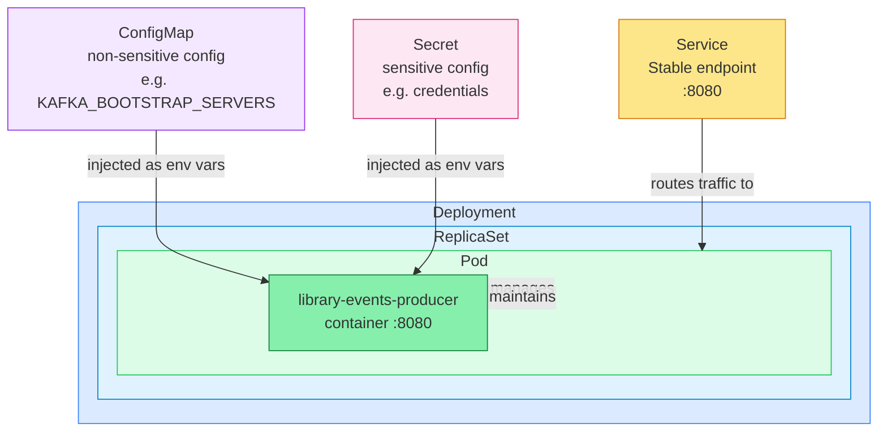

We will implement each component step by step in the sections that follow.

---

## Section 6: Deploying the library-events-producer App

### What is a Deployment?

A Deployment is how you tell Kubernetes to run your application. You describe *what* you want — which container image to run, how many replicas, what environment variables to inject, and how to check the app is healthy — and Kubernetes takes care of making it happen and keeping it running.

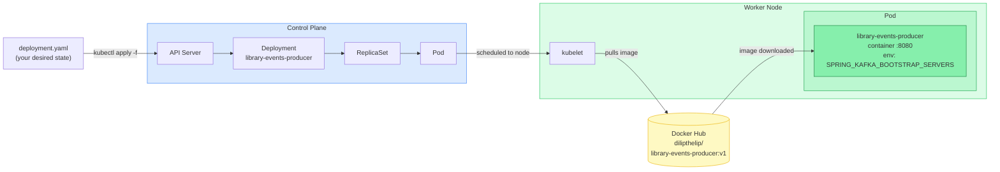

---

### The Deployment Manifest

```yaml
# library-events-producer-deployment-v1.yaml
apiVersion: apps/v1
kind: Deployment
metadata:
  name: library-events-producer
  labels:
    app: library-events-producer
spec:
  replicas: 1                          # single instance for local development
  selector:
    matchLabels:
      app: library-events-producer     # links this Deployment to its Pods
  template:                            # Pod template — every Pod created looks like this
    metadata:
      labels:
        app: library-events-producer
    spec:
      containers:
        - name: library-events-producer
          image: dilipthelip/library-events-producer:v1
          imagePullPolicy: Always      # always pull the latest image on startup
          ports:
            - containerPort: 8080      # the port the app listens on inside the container
          env:
            - name: SPRING_KAFKA_BOOTSTRAP_SERVERS
              value: "host.docker.internal:29092"   # Kafka broker reachable from inside Minikube
          resources:
            requests:                  # minimum resources guaranteed to this container
              cpu: "250m"              # 250 millicores = 0.25 of a CPU core
              memory: "256Mi"
            limits:                    # maximum resources this container is allowed to use
              cpu: "500m"
              memory: "512Mi"
```

---

### Manifest Field Breakdown

**Top-level fields:**

| Field | Value | What it means |
|---|---|---|
| `apiVersion` | `apps/v1` | The Kubernetes API group and version that handles Deployments |
| `kind` | `Deployment` | The type of object being created |
| `metadata.name` | `library-events-producer` | The name used to identify this Deployment in the cluster |
| `metadata.labels` | `app: library-events-producer` | Key-value tags attached to the object — used for selection and filtering |

**Spec fields:**

| Field | Value | What it means |
|---|---|---|
| `replicas` | `1` | Run exactly 1 Pod at all times |
| `selector.matchLabels` | `app: library-events-producer` | The Deployment manages Pods that carry this label |
| `template` | — | The blueprint for every Pod this Deployment creates |

**Container fields:**

| Field | Value | What it means |
|---|---|---|
| `image` | `dilipthelip/library-events-producer:v1` | The Docker image to run |
| `imagePullPolicy` | `Always` | Always pull the image from the registry on startup — ensures you never run a stale cached image |
| `containerPort` | `8080` | The port the Spring Boot app listens on inside the container |

**Environment variables:**

| Variable | Value | What it means |
|---|---|---|
| `SPRING_KAFKA_BOOTSTRAP_SERVERS` | `host.docker.internal:29092` | Tells the Spring Boot app where to find the Kafka broker. `host.docker.internal` resolves to your Mac's localhost from inside a Docker/Minikube container |

**Resource requests and limits:**

| Field | Value | What it means |
|---|---|---|
| `requests.cpu` | `250m` | The scheduler guarantees at least 0.25 CPU cores for this container |
| `requests.memory` | `256Mi` | The scheduler guarantees at least 256 MiB of RAM |
| `limits.cpu` | `500m` | The container cannot use more than 0.5 CPU cores |
| `limits.memory` | `512Mi` | If the container exceeds 512 MiB, Kubernetes will kill and restart it |

---

### What is a Pod?

A Pod is the smallest deployable unit in Kubernetes. When you create a Deployment, Kubernetes does not run your container directly — it wraps it inside a Pod first.

Think of a Pod as a thin envelope around your container that provides:
- A **unique IP address** within the cluster
- Shared **network namespace** — all containers in the same Pod communicate over `localhost`
- Shared **storage volumes** — containers in the same Pod can read and write the same files
- **Environment variables** — injected at startup, visible to the running process

**Key things to know:**
- Every container in Kubernetes runs inside a Pod
- Pods are **ephemeral** — if one crashes, Kubernetes creates a brand new Pod to replace it (it does not restart the same one)
- A Deployment manages Pods and ensures the right number are always running
- Each Pod gets a unique auto-generated name, e.g. `library-events-producer-6b7d9f8c4d-xk9p2`

**Analogy:** Think of a Deployment as a process supervisor (like `systemd` or `supervisord`) configured to keep 1 instance of your app running at all times. A Pod is the actual running process. If the process dies (pod crashes), the supervisor (Kubernetes) immediately spawns a new process to replace it — without any manual intervention.

**Non-tech analogy:** If a Deployment is a job posting saying "we need 1 barista at all times", then a Pod is that individual barista. If the barista quits (pod crashes), the manager (Deployment) immediately hires a new one.

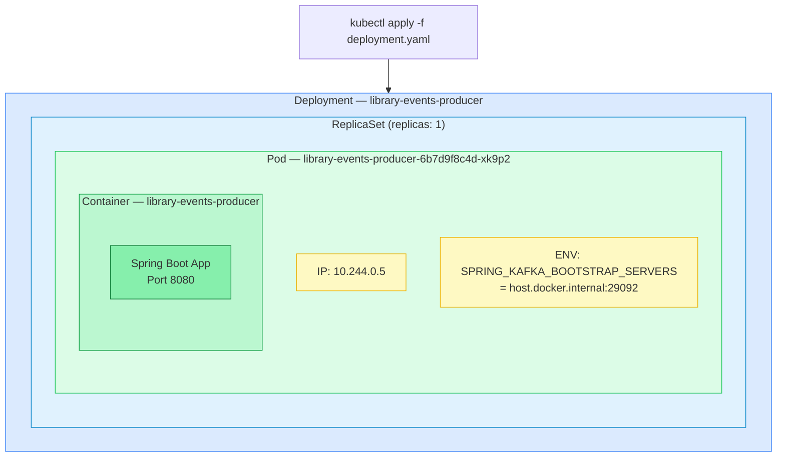

**Pod lifecycle states:**

| Status | Meaning |
|---|---|
| `Pending` | Pod accepted by the cluster but the container image is still being pulled |
| `Running` | Container is up and the app is running inside the Pod |
| `Succeeded` | Container finished and exited successfully (typically batch jobs) |
| `Failed` | Container exited with an error |
| `CrashLoopBackOff` | Container keeps crashing — Kubernetes keeps restarting it with increasing back-off delays |

---

### Apply the Deployment

```shell
kubectl apply -f library-events-producer-deployment-v1.yaml
```

**Verify it is running:**

```shell
kubectl get deployments
kubectl get pods
```

Expected output:

```
NAME                       READY   UP-TO-DATE   AVAILABLE   AGE
library-events-producer    1/1     1            1           30s

NAME                                        READY   STATUS    RESTARTS   AGE
library-events-producer-6b7d9f8c4d-xk9p2   1/1     Running   0          30s
```

**Verify the environment variable was injected:**

```shell
kubectl exec -it <pod-name> -- env | grep KAFKA
```

Expected output:

```
SPRING_KAFKA_BOOTSTRAP_SERVERS=host.docker.internal:29092
```

---

**Viewing logs:**

```shell
# Print all logs from the pod
kubectl logs <pod-name>

# Tail the last N lines
kubectl logs <pod-name> --tail=100

# Follow logs in real time (like tail -f)
kubectl logs -f <pod-name>

# Follow logs and show the last 50 lines first
kubectl logs -f <pod-name> --tail=50
```

> If the pod has restarted and you want logs from the previous (crashed) instance:
> ```shell
> kubectl logs <pod-name> --previous
> ```

---

**Logging into the pod (interactive shell):**

```shell
# Open a bash shell inside the running container
kubectl exec -it <pod-name> -- /bin/bash

# If bash is not available (minimal images), try sh
kubectl exec -it <pod-name> -- /bin/sh
```

Once inside the container you can:

```shell
# Check environment variables
env | grep KAFKA

# Inspect the filesystem
ls /app

# Test network connectivity to Kafka
curl -v host.docker.internal:29092

# Exit the shell
exit
```

> `kubectl exec -it` is the Kubernetes equivalent of `docker exec -it`. The `-i` flag keeps stdin open and `-t` allocates a terminal — both are needed for an interactive session.

---

**Delete the Deployment:**

```shell
kubectl delete -f library-events-producer-deployment-v1.yaml
```

---

### Self-Healing in Action

One of Kubernetes' most powerful behaviours is **self-healing** — if a Pod crashes or is deleted, the Deployment controller immediately notices the gap between desired state (1 replica) and actual state (0 running), and creates a brand new Pod to fill it.

You never have to manually restart a crashed application.

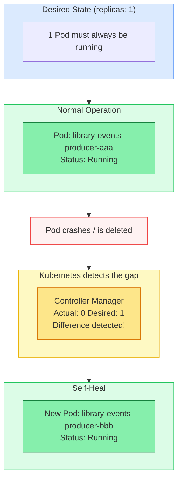

**Notice that the new Pod gets a different name** (`-bbb` instead of `-aaa`) — Kubernetes does not restart the old Pod, it creates an entirely new one.

---

**Try it yourself — simulate a crash by deleting the Pod:**

```shell
# Step 1: note the current pod name
kubectl get pods

# Step 2: delete the pod (simulates a crash)
kubectl delete pod <pod-name>

# Step 3: immediately watch Kubernetes create a replacement
kubectl get pods --watch
```

Expected output — you will see the old Pod terminating and a brand new Pod spinning up within seconds:

```
NAME                                        READY   STATUS        RESTARTS   AGE
library-events-producer-6b7d9f8c4d-xk9p2   1/1     Terminating   0          5m
library-events-producer-6b7d9f8c4d-m3np1   0/1     Pending       0          1s
library-events-producer-6b7d9f8c4d-m3np1   1/1     Running       0          8s
```

> The Deployment is still intact — only the Pod was deleted. Kubernetes immediately reconciled actual state back to desired state without any manual intervention.

---

---

## Section 7: Exposing the library-events-producer App

### The Problem with Pods Alone

Your application is now running inside a Pod, but Pods have two fundamental limitations that make them unreachable on their own:

- **Pods are ephemeral** — when a Pod crashes and is replaced, it gets a brand new IP address. Anything trying to reach the old IP will fail.
- **Pod IPs are internal** — they are only reachable inside the cluster. Nothing outside (your browser, another service, the internet) can reach them directly.

This is where a **Service** comes in.

---

### What is a Service?

A Service is a stable, long-lived endpoint that sits in front of your Pods. It gives you:

- A **fixed IP and DNS name** that never changes, even as Pods come and go
- **Automatic load balancing** across all healthy Pods behind it
- A **consistent port** your clients always connect to

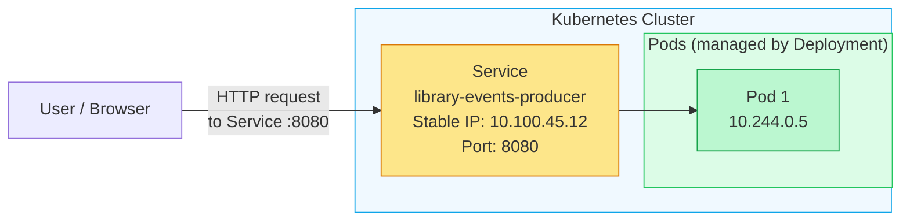

Even if Pod 1 crashes and is replaced by Pod 2 with a different IP, the Service IP stays the same — clients never need to be updated.

---

### Service Manifest

```yaml
# library-events-producer-service.yaml
apiVersion: v1
kind: Service
metadata:
  name: library-events-producer
  namespace: default
  labels:
    app: library-events-producer
spec:
  type: NodePort                  # exposes the service on a port on the node
  selector:
    app: library-events-producer  # routes traffic to Pods with this label
  ports:
    - port: 8080                  # the port the Service listens on inside the cluster
      targetPort: 8080            # the port the container inside the Pod listens on
      protocol: TCP
```

**Field breakdown:**

| Field | Value | What it means |
|---|---|---|
| `type` | `NodePort` | Opens a port on the Minikube node so the app is reachable from outside the cluster |
| `selector` | `app: library-events-producer` | The Service forwards traffic to any Pod carrying this label |
| `port` | `8080` | The port clients use to talk to the Service |
| `targetPort` | `8080` | The port the container inside the Pod is actually listening on |

**Apply the Service:**

```shell
kubectl apply -f library-events-producer-service.yaml
```

**Verify it was created:**

```shell
kubectl get services
```

Expected output:

```
NAME                       TYPE       CLUSTER-IP      EXTERNAL-IP   PORT(S)          AGE
library-events-producer    NodePort   10.100.45.12    <none>        8080:30742/TCP   10s
```

---

### Accessing the App on Minikube

With the Docker driver on macOS, the Minikube node runs inside a Docker container with its own internal IP (`192.168.49.2`) that your Mac cannot reach directly. `minikube service` creates a local tunnel to bridge that gap.

```shell
minikube service library-events-producer
```

Example output:

```
┌───────────┬─────────────────────────┬─────────────┬───────────────────────────┐
│ NAMESPACE │          NAME           │ TARGET PORT │            URL            │
├───────────┼─────────────────────────┼─────────────┼───────────────────────────┤
│ default   │ library-events-producer │ 8080        │ http://192.168.49.2:30742 │
└───────────┴─────────────────────────┴─────────────┴───────────────────────────┘
Starting tunnel for service library-events-producer.
┌───────────┬─────────────────────────┬─────────────┬────────────────────────┐
│ NAMESPACE │          NAME           │ TARGET PORT │          URL           │
├───────────┼─────────────────────────┼─────────────┼────────────────────────┤
│ default   │ library-events-producer │             │ http://127.0.0.1:52786 │
└───────────┴─────────────────────────┴─────────────┴────────────────────────┘
```

Two tables appear because there are two sides to what `minikube service` is doing:

| Table | IP | Port | What it is |
|---|---|---|---|
| First | `192.168.49.2` | `30742` | The real NodePort inside Docker's network — unreachable from your Mac directly |
| Second | `127.0.0.1` | `52786` | The tunnel endpoint on your Mac — what your browser actually connects to |

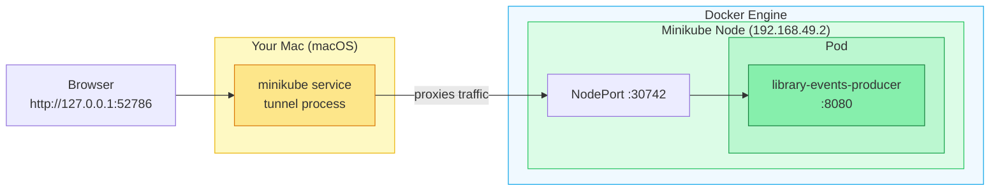

**Why is the tunnel needed?**

When Minikube uses the Docker driver on macOS, the entire Kubernetes node runs as a Docker container. That container lives inside Docker's private internal network and is assigned an IP like `192.168.49.2` — a virtual address that only exists within Docker's network bridge. Your Mac has no routing table entry for that subnet, so opening `http://192.168.49.2:30742` in a browser simply times out.

`minikube service` solves this by starting a proxy process on your Mac that:
1. Binds a random port on `127.0.0.1` (your Mac's localhost)
2. Forwards every TCP packet it receives to the NodePort inside the Docker container network

This is why you get two URLs — the first is the real NodePort (unreachable from your Mac), the second is the localhost tunnel you can actually use.

```text
Your Mac
  Browser → http://127.0.0.1:52786
                  |
                  | ← minikube tunnel (proxies traffic)
                  |
  Docker Engine
      |
      Minikube node container (192.168.49.2)
              |
              NodePort :30742
                      |
                      Service → Pod :8080
```

> On Linux or with a VM-based driver (HyperKit, VirtualBox), the Minikube node gets a real network interface on the host so its IP is directly routable — no tunnel is needed. The Docker driver on macOS requires this workaround.

> The terminal must stay open — the `minikube service` process itself acts as the proxy. Closing it kills the tunnel.

**Access the Swagger UI:**

```
http://127.0.0.1:<port>/swagger-ui/index.html
```

Replace `<port>` with the port shown in your terminal output (e.g. `52786`).

**Delete the Service:**

```shell
kubectl delete -f library-events-producer-service.yaml
```

---

### Option 2 — kubectl port-forward

For quick local access — testing, debugging, or inspecting an API — `kubectl port-forward` is a faster alternative. It creates a direct tunnel from a port on your local machine straight into a specific Pod, bypassing the cluster's networking layer entirely. No Service object required.

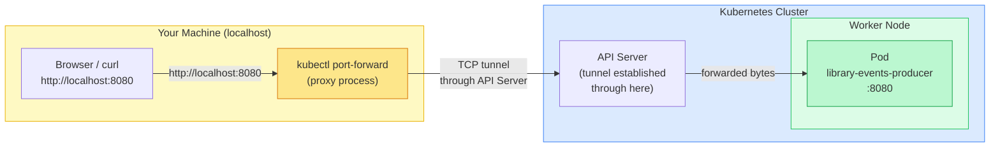

**Step 1 — Get the Pod name:**

```shell
kubectl get pods
```

**Step 2 — Forward a local port to the Pod:**

```shell
kubectl port-forward pod/library-events-producer-6b7d9f8c4d-xk9p2 8080:8080
```

| Part | Meaning |
|---|---|
| `pod/library-events-producer-...` | The specific Pod to tunnel into |
| `8080:8080` | `<local-port>:<pod-port>` — your machine's port 8080 maps to the Pod's port 8080 |

Expected output:

```
Forwarding from 127.0.0.1:8080 -> 8080
Forwarding from [::1]:8080 -> 8080
```

**Step 3 — Access the app:**

```shell
# Health check
curl http://localhost:8080/actuator/health

# Or open the Swagger UI
open http://localhost:8080/swagger-ui/index.html
```

**You can also forward to a Deployment or Service instead of a specific Pod:**

```shell
# Forward to a Deployment (picks one backing Pod)
kubectl port-forward deployment/library-events-producer 8080:8080

# Forward to a Service (picks one Pod behind the Service)
kubectl port-forward service/library-events-producer 8080:8080
```

**Use a different local port if 8080 is already in use:**

```shell
kubectl port-forward pod/<pod-name> 9090:8080
# Access via http://localhost:9090
```

**Service vs port-forward — when to use which:**

| | Service | kubectl port-forward |
|---|---|---|
| **Purpose** | Stable production endpoint | Temporary local tunnel for dev/debug |
| **Traffic path** | `Client → NodePort → kube-proxy → Pod` | `localhost → kubectl → API Server → Pod` |
| **Targets** | All healthy Pods (load balanced) | One specific Pod |
| **Survives Pod restart?** | Yes | No — tunnel is pinned to the original Pod |
| **Requires Service object?** | Yes | No |
| **When to use** | Persistent exposure for users or other services | Quick local testing, API inspection, debugging |

> `kubectl port-forward` is for local development only. It is not a replacement for a Service.

**What happens when there are multiple Pods?**

`kubectl port-forward` always targets exactly one Pod — it does not load balance:

| How you run it | Behaviour with multiple Pods |
|---|---|
| `pod/<specific-name> 8080:8080` | Pinned to that Pod only — other Pods receive no traffic |
| `deployment/library-events-producer 8080:8080` | Kubernetes picks one Pod at random when the command runs and sticks to it |
| `service/library-events-producer 8080:8080` | Same — picks one Pod and pins the tunnel to it for the session |

In all cases, if the chosen Pod crashes and is replaced, the tunnel breaks — you must re-run the command to reconnect. If you have multiple Pods and need traffic distributed across all of them, use `minikube service` or Ingress instead — both route through the Service and load balance across all healthy Pods.

---

### Option 3 — Ingress

Ingress is the third and most production-ready way to expose your app. Rather than opening ports on nodes (NodePort) or running tunnels (port-forward), Ingress lets you route HTTP traffic to your app using a **hostname or URL path** — just like a real web application.

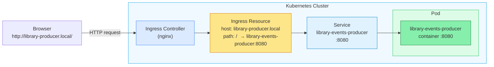

**Ingress Manifest:**

```yaml
# library-events-producer-ingress.yaml
apiVersion: networking.k8s.io/v1
kind: Ingress
metadata:
  name: library-events-producer-ingress
  namespace: default
  labels:
    app: library-events-producer
spec:
  ingressClassName: nginx           # use the nginx Ingress Controller
  rules:
    - host: library-producer.local  # requests to this hostname are handled here
      http:
        paths:
          - path: /
            pathType: Prefix
            backend:
              service:
                name: library-events-producer
                port:
                  number: 8080
```

**Enable the Ingress addon on Minikube:**

```shell
minikube addons enable ingress
```

Wait until the Ingress Controller pod is fully `Running` before applying the Ingress manifest — this can take up to 60 seconds:

```shell
kubectl get pods -n ingress-nginx --watch
```

You should see something like this:

```
NAME                                        READY   STATUS      RESTARTS   AGE
ingress-nginx-admission-create-vgtbq        0/1     Completed   0          5m35s
ingress-nginx-admission-patch-ffh77         0/1     Completed   1          5m35s
ingress-nginx-controller-596f8778bc-p7cz7   1/1     Running     0          5m35s
```

| Pod | Status | What it means |
|---|---|---|
| `ingress-nginx-admission-create` | `Completed` | One-time Job that created the TLS cert for the webhook — done, this is expected |
| `ingress-nginx-admission-patch` | `Completed` | One-time Job that patched the webhook config — done, this is expected |
| `ingress-nginx-controller` | `1/1 Running` | The actual Ingress Controller — **this is the one that matters** |

Once `ingress-nginx-controller` shows `1/1 Running`, press `Ctrl+C` to stop watching — the addon is ready.

> **Troubleshooting — `failed calling webhook` error:**
> If you apply the Ingress manifest too early and see:
> ```
> Internal error occurred: failed calling webhook "validate.nginx.ingress.kubernetes.io":
> failed to call webhook: Post "https://ingress-nginx-controller-admission.ingress-nginx.svc:443/...":
> dial tcp ...: connect: connection refused
> ```
> The admission webhook controller is not ready yet. Fix it by deleting the webhook and re-applying:
> ```shell
> kubectl delete -A ValidatingWebhookConfiguration ingress-nginx-admission
> kubectl apply -f library-events-producer-ingress.yaml
> ```

**Apply the Ingress:**

```shell
kubectl apply -f library-events-producer-ingress.yaml
```

**Verify it was created:**

```shell
kubectl get ingress
```

Expected output:

```
NAME                               CLASS   HOSTS                    ADDRESS        PORTS   AGE
library-events-producer-ingress    nginx   library-producer.local   192.168.49.2   80      10s
```

**Add the hostname to your hosts file so your Mac resolves it:**

```shell
# Get the Minikube IP
minikube ip

# Add the entry (replace with your minikube IP)
echo "192.168.49.2  library-producer.local" | sudo tee -a /etc/hosts
```

**Access the app:**

```
http://library-producer.local/swagger-ui/index.html
```

> On macOS with the Docker driver you may still need `minikube tunnel` running in a separate terminal for the Ingress IP to be reachable:
> ```shell
> minikube tunnel
> ```

**Delete the Ingress:**

```shell
kubectl delete -f library-events-producer-ingress.yaml
```

---

**Summary — three ways to access the app:**

| Method | Command | Best for |
|---|---|---|
| **minikube service** | `minikube service library-events-producer` | Quick local access via NodePort tunnel |
| **port-forward** | `kubectl port-forward pod/<name> 8080:8080` | Debugging a specific Pod locally |
| **Ingress** | Add hosts entry + apply ingress manifest | Host-based routing, closest to production |

---

### Quick Reference — Launch and Test Commands

#### Option 1 — minikube service (NodePort tunnel)

```shell
# Apply the Deployment and Service
kubectl apply -f library-events-producer-deployment-v1.yaml
kubectl apply -f library-events-producer-service.yaml

# Verify both are running
kubectl get deployments
kubectl get pods
kubectl get services

# Open the tunnel and get the local URL
minikube service library-events-producer
```

```shell
# Test (replace <port> with the port printed by minikube service)
curl http://127.0.0.1:<port>/actuator/health
open http://127.0.0.1:<port>/swagger-ui/index.html
```

```shell
# Delete
kubectl delete -f library-events-producer-service.yaml
kubectl delete -f library-events-producer-deployment-v1.yaml
```

---

#### Option 2 — kubectl port-forward

```shell
# Apply the Deployment
kubectl apply -f library-events-producer-deployment-v1.yaml

# Verify the Pod is running
kubectl get pods

# Forward local port 8080 to the Pod
kubectl port-forward deployment/library-events-producer 8080:8080
```

```shell
# Test (in a separate terminal)
curl http://localhost:8080/actuator/health
open http://localhost:8080/swagger-ui/index.html
```

```shell
# Delete
kubectl delete -f library-events-producer-deployment-v1.yaml
```

---

#### Option 3 — Ingress

```shell
# Enable the Ingress addon (once)
minikube addons enable ingress

# Add the hostname to your hosts file (once)
echo "$(minikube ip)  library-producer.local" | sudo tee -a /etc/hosts

# Apply the Deployment, Service, and Ingress
kubectl apply -f library-events-producer-deployment-v1.yaml
kubectl apply -f library-events-producer-service.yaml
kubectl apply -f library-events-producer-ingress.yaml

# Verify all resources are up
kubectl get deployments
kubectl get pods
kubectl get services
kubectl get ingress

# Start the tunnel in a separate terminal (Docker driver on macOS)
minikube tunnel
```

```shell
# Test
curl http://library-producer.local/actuator/health
open http://library-producer.local/swagger-ui/index.html
```

```shell
# Delete
kubectl delete -f library-events-producer-ingress.yaml
kubectl delete -f library-events-producer-service.yaml
kubectl delete -f library-events-producer-deployment-v1.yaml
```

---

*More chapters coming soon — ConfigMaps, Secrets, and more.*

---

## Section 8: Scaling to Multiple Replicas

So far we have been running a single instance of `library-events-producer`. Scaling to 3 replicas means Kubernetes will keep 3 Pods running at all times — if one crashes, a replacement is created immediately. The Service automatically distributes incoming traffic across all 3 healthy Pods.

### Why Scale?

Running a single Pod in production is a risk. Here is why scaling matters:

- **High availability** — if the single Pod crashes, your app is down until Kubernetes creates a replacement (a few seconds of downtime). With 3 replicas, the other 2 keep serving traffic while the replacement starts.
- **Load distribution** — a single Pod handles all incoming requests. Under heavy traffic it can become a bottleneck or run out of memory. Multiple replicas share the load.
- **Zero-downtime rolling updates** — when you deploy a new version, Kubernetes replaces Pods one at a time. With only 1 replica, there is a brief gap. With 3, at least 2 are always serving traffic during the update.
- **Resilience to node failure** — if the worker node running your Pod goes down, the Pod is lost. With 3 replicas spread across nodes, only 1 is lost and the other 2 continue serving.

### What Kubernetes Does When You Scale

When you change `replicas` from 1 to 3, here is what happens internally:

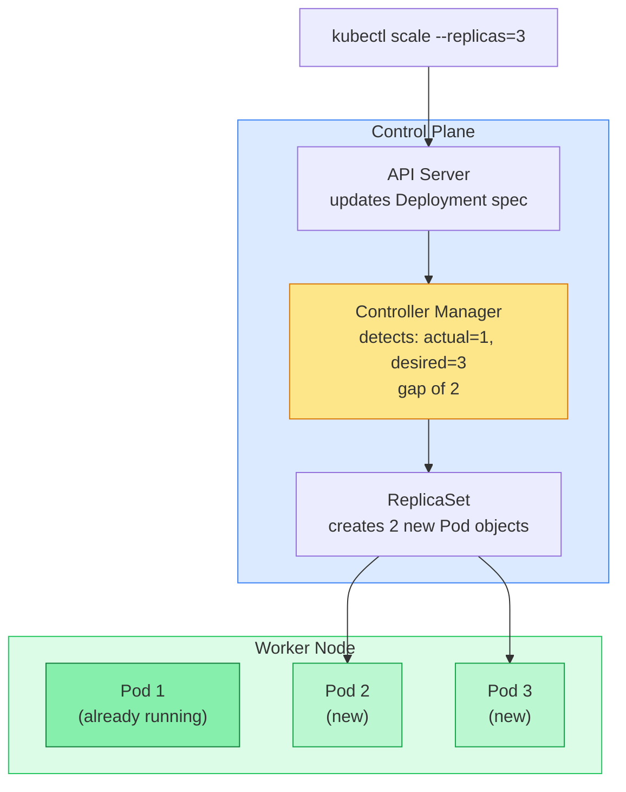

- **Step 1** — You run `kubectl scale` or apply an updated manifest
- **Step 2** — The API Server updates the desired replica count in etcd
- **Step 3** — The Controller Manager notices the gap: actual (1) ≠ desired (3)
- **Step 4** — The ReplicaSet creates 2 new Pod objects
- **Step 5** — The Scheduler assigns each new Pod to a suitable node
- **Step 6** — The kubelet on each node pulls the image and starts the container
- **The original Pod is untouched** — scaling up never restarts existing Pods

### Scaling the Deployment

**Option 1 — Apply the replicas manifest:**

```shell
kubectl apply -f library-events-producer-deployment-v2.yaml
```

**Option 2 — Scale imperatively without a new file:**

```shell
kubectl scale deployment library-events-producer --replicas=3
```

**Verify the rollout:**

```shell
kubectl get deployments
kubectl get pods
```

Expected output:

```
NAME                       READY   UP-TO-DATE   AVAILABLE   AGE
library-events-producer    3/3     3            3           2m

NAME                                        READY   STATUS    RESTARTS   AGE
library-events-producer-6b7d9f8c4d-xk9p2   1/1     Running   0          2m
library-events-producer-6b7d9f8c4d-m3np1   1/1     Running   0          30s
library-events-producer-6b7d9f8c4d-tz8lw   1/1     Running   0          30s
```

**Watch the rollout live:**

```shell
kubectl rollout status deployment/library-events-producer
```

```
Waiting for deployment "library-events-producer" rollout to finish: 1 of 3 updated replicas are available...
Waiting for deployment "library-events-producer" rollout to finish: 2 of 3 updated replicas are available...
deployment "library-events-producer" successfully rolled out
```

---

### How the Service Routes Traffic Across 3 Replicas

With a single Pod, traffic has only one destination. With 3 Pods, the Service acts as a load balancer — it tracks all healthy Pods via label selectors and round-robins requests across them. Each Pod gets its own IP, but clients only ever talk to the stable Service IP.

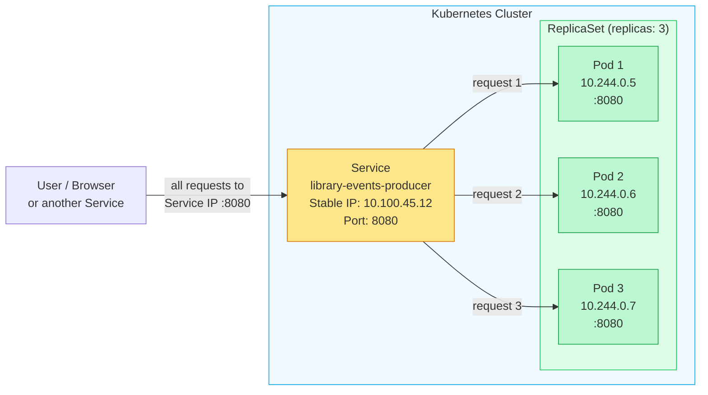

- The **Service IP never changes** — clients always connect to the same address
- The **Pod IPs change** every time a Pod is replaced — clients never need to know them
- The **Service selector** (`app: library-events-producer`) automatically picks up any new Pod with that label, including freshly created replacements after a crash

---

### Scale Back Down

```shell
# Scale back to 1
kubectl scale deployment library-events-producer --replicas=1

# Or apply the original single-replica manifest
kubectl apply -f library-events-producer-deployment-v1.yaml
```

---

## Section 9: ConfigMaps — Decoupling Configuration from Code

### The Problem with Hardcoded Config

In the original deployment manifest, the Kafka bootstrap server address was hardcoded directly inside the YAML:

```yaml
env:
  - name: SPRING_KAFKA_BOOTSTRAP_SERVERS
    value: "host.docker.internal:29092"
```

This approach has several drawbacks:

- **Tightly coupled** — changing a config value means editing and reapplying the Deployment manifest
- **Not reusable** — each Deployment carries its own copy of the config; updating across multiple deployments is error-prone
- **Not environment-aware** — you would need separate Deployment files for dev, staging, and production just because the config differs
- **Mixes concerns** — infrastructure config (what the app needs to run) is buried inside the workload spec

A **ConfigMap** solves this by storing configuration as a standalone Kubernetes object that Pods reference at runtime.

---

### What is a ConfigMap?

A ConfigMap is a Kubernetes object that stores **non-sensitive** key-value configuration data separately from your container image and Deployment spec. Pods consume it at runtime — either as environment variables or mounted files.

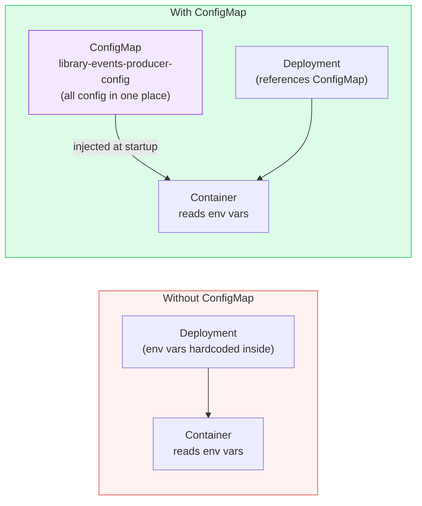

**Key benefits:**

- **Decoupled** — config lives independently of the Deployment; update the ConfigMap without touching the Deployment
- **Reusable** — multiple Deployments can reference the same ConfigMap
- **Environment-specific** — swap in a different ConfigMap per environment (dev/staging/prod) without changing the Deployment spec
- **Auditable** — config changes are tracked as Kubernetes object updates

> ConfigMaps are for **non-sensitive** data only. Never store passwords, tokens, or private keys in a ConfigMap — use a **Secret** for those (covered in the next section).

---

### The ConfigMap Manifest

```yaml
# library-events-producer-configmap.yaml
apiVersion: v1
kind: ConfigMap
metadata:
  name: library-events-producer-config
  namespace: default
  labels:
    app: library-events-producer
data:
  SPRING_KAFKA_BOOTSTRAP_SERVERS: "host.docker.internal:29092,host.docker.internal:29094,host.docker.internal:29096"
  SPRING_PROFILES_ACTIVE: "dev"
  SERVER_PORT: "8080"
  LOG_LEVEL: "INFO"
```

**Field breakdown:**

| Field | Value | What it means |
|---|---|---|
| `kind` | `ConfigMap` | The type of Kubernetes object |
| `metadata.name` | `library-events-producer-config` | The name Deployments use to reference this ConfigMap |
| `data` | key-value pairs | Each key becomes an environment variable name inside the container |

**Config keys explained:**

| Key | Value | Purpose |
|---|---|---|
| `SPRING_KAFKA_BOOTSTRAP_SERVERS` | `host.docker.internal:29092,...` | All three Kafka broker addresses — app connects to whichever is available |
| `SPRING_PROFILES_ACTIVE` | `dev` | Activates the Spring Boot `dev` profile |
| `SERVER_PORT` | `8080` | The port the embedded Tomcat server listens on |
| `LOG_LEVEL` | `INFO` | Controls application log verbosity |

---

### The Updated Deployment — v3

The v3 deployment replaces the inline `env` block with `envFrom`, which loads **all keys** from the ConfigMap as environment variables in a single line:

```yaml
# library-events-producer-deployment-v3.yaml
apiVersion: apps/v1
kind: Deployment
metadata:
  name: library-events-producer
  labels:
    app: library-events-producer
spec:
  replicas: 3
  selector:
    matchLabels:
      app: library-events-producer
  template:
    metadata:
      labels:
        app: library-events-producer
    spec:
      containers:
        - name: library-events-producer
          image: dilipthelip/library-events-producer:v1
          imagePullPolicy: Always
          ports:
            - containerPort: 8080
          envFrom:
            - configMapRef:
                name: library-events-producer-config   # all keys from the ConfigMap become env vars
          resources:
            requests:
              cpu: "250m"
              memory: "256Mi"
            limits:
              cpu: "500m"
              memory: "512Mi"
```

**`env` vs `envFrom` — what changed:**

| | `env` (v1) | `envFrom` (v3) |
|---|---|---|
| **How config is defined** | Hardcoded inline in the Deployment | Stored in a separate ConfigMap object |
| **Adding a new variable** | Edit the Deployment, reapply | Add to the ConfigMap, no Deployment change needed |
| **Reusability** | One Deployment only | Any number of Deployments can reference the same ConfigMap |
| **Syntax** | One entry per variable | One line loads all keys from the ConfigMap |

---

### How ConfigMap Keys Become Environment Variables

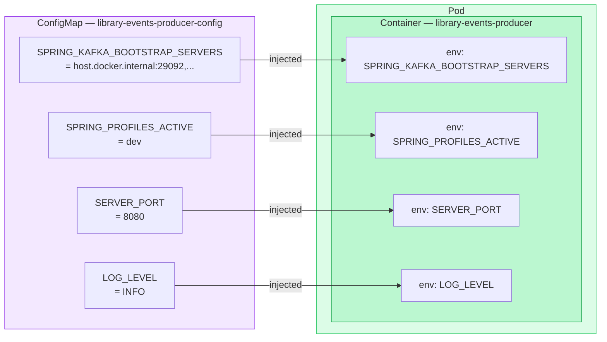

---

### Apply the ConfigMap and Deploy

```shell
# Step 1 — Apply the ConfigMap first (Deployment references it at startup)
kubectl apply -f library-events-producer-configmap.yaml

# Step 2 — Apply the v3 Deployment
kubectl apply -f library-events-producer-deployment-v3.yaml
```

**Verify the ConfigMap was created:**

```shell
kubectl get configmaps
kubectl describe configmap library-events-producer-config
```

Expected output from `describe`:

```
Name:         library-events-producer-config
Namespace:    default
Labels:       app=library-events-producer

Data
====
LOG_LEVEL:
----
INFO
SERVER_PORT:
----
8080
SPRING_KAFKA_BOOTSTRAP_SERVERS:
----
host.docker.internal:29092,host.docker.internal:29094,host.docker.internal:29096
SPRING_PROFILES_ACTIVE:
----
dev
```

**Verify the env vars were injected into the Pod:**

```shell
kubectl exec -it <pod-name> -- env | grep -E "KAFKA|SPRING|SERVER|LOG"
```

Expected output:

```
SPRING_KAFKA_BOOTSTRAP_SERVERS=host.docker.internal:29092,host.docker.internal:29094,host.docker.internal:29096
SPRING_PROFILES_ACTIVE=dev
SERVER_PORT=8080
LOG_LEVEL=INFO
```

**Delete:**

```shell
kubectl delete -f library-events-producer-deployment-v3.yaml
kubectl delete -f library-events-producer-configmap.yaml
```

> Always apply the ConfigMap **before** the Deployment — if the Deployment starts and the referenced ConfigMap does not exist yet, the Pod will fail to start with an `CreateContainerConfigError`.

---

### Does a ConfigMap Change Require Redeployment?

**Yes — when using `envFrom` or `env` (our approach).**

Environment variables are injected into a Pod **once at startup**. They are baked into the running process. If you update the ConfigMap after the Pod is already running, the change is stored in Kubernetes but the running Pod does not see it — its environment is frozen from the moment it started.

```mermaid
flowchart TD
    CM["ConfigMap updated\nLOG_LEVEL: DEBUG"]

    subgraph RUNNING["Currently Running Pod"]
        ENV["env: LOG_LEVEL=INFO\n(frozen at startup — unchanged)"]
    end

    subgraph NEW["New Pod (after rollout restart)"]
        ENV2["env: LOG_LEVEL=DEBUG\n(picks up new value at startup)"]
    end

    CM -- "stored in etcd\nbut NOT reflected in running Pod" --> RUNNING
    CM -- "reflected after\nPod restart" --> NEW

    style RUNNING fill:#fef2f2,stroke:#ef4444
    style NEW fill:#dcfce7,stroke:#22c55e
    style CM fill:#f3e8ff,stroke:#9333ea
    style ENV fill:#fee2e2,stroke:#dc2626
    style ENV2 fill:#bbf7d0,stroke:#16a34a
```

**To apply a ConfigMap change to running Pods, trigger a rollout restart:**

```shell
# Step 1 — Update and apply the ConfigMap
kubectl apply -f library-events-producer-configmap.yaml

# Step 2 — Restart the Deployment (kills old Pods and starts new ones)
kubectl rollout restart deployment/library-events-producer

# Step 3 — Watch the rollout
kubectl rollout status deployment/library-events-producer
```

`kubectl rollout restart` performs a **rolling restart** — it replaces Pods one at a time so your app stays available during the restart. New Pods start fresh and pick up the updated ConfigMap values.

---

**Summary — when is redeployment needed?**

| How ConfigMap is consumed | Change reflects automatically? | Action needed |
|---|---|---|
| `envFrom` / `env` (environment variables) | No — env vars are frozen at Pod startup | `kubectl rollout restart deployment/<name>` |
| Mounted as a file (volume mount) | Yes — Kubernetes syncs the file automatically (within ~60s) | No restart needed |

> We are using `envFrom` in this guide, so **every ConfigMap change requires a rollout restart** to take effect.

---

## Section 10: Liveness and Readiness Probes

### The Problem Without Probes

Without probes, Kubernetes has no way to know whether your application is actually working. It only knows if the **container process is running** — not whether the application inside is healthy and ready to serve traffic. This leads to two common problems:

- **Stuck app, live container** — the Spring Boot app starts, but gets stuck in a deadlock or runs out of memory. The container is still running, so Kubernetes keeps sending it traffic — all of which fails.
- **Traffic before ready** — a new Pod starts and Kubernetes immediately routes requests to it, but the Spring Boot app hasn't finished initialising yet. Requests fail until the app is ready.

Probes solve both problems.

---

### What is a Liveness Probe?

A **Liveness Probe** answers the question: **"Is this application still alive?"**

Kubernetes runs the probe on a schedule. If it fails enough times in a row, Kubernetes assumes the container is broken and **restarts it**.

```mermaid
flowchart TD
    KUB["Kubernetes\nchecks liveness every 10s"]

    OK["Probe returns HTTP 200\nContainer is healthy\nNo action taken"]
    FAIL["Probe fails 3 times in a row\nContainer is stuck/broken"]
    RESTART["Kubernetes restarts\nthe container"]

    KUB -- "GET /actuator/health/liveness" --> OK
    KUB -- "GET /actuator/health/liveness" --> FAIL
    FAIL --> RESTART
    RESTART -- "fresh container starts" --> KUB

    style OK fill:#dcfce7,stroke:#22c55e
    style FAIL fill:#fef2f2,stroke:#ef4444
    style RESTART fill:#fef9c3,stroke:#eab308
```

**Use liveness when:** the app can get into a broken state (deadlock, memory leak, hung thread) where the process is still running but no longer functional. Kubernetes will automatically restart it.

**Watch liveness probe status:**

```shell
# See liveness probe config and recent failures in the Events section
kubectl describe pod <pod-name>

# Watch for liveness probe failures and container restarts in real time
kubectl get pods --watch

# Check restart count — a rising RESTARTS count indicates liveness probe failures
kubectl get pods
# NAME                                        READY   STATUS    RESTARTS   AGE
# library-events-producer-6b7d9f8c4d-xk9p2   1/1     Running   3          10m

# See cluster-level liveness failure events
kubectl get events --field-selector reason=Unhealthy

# Watch all cluster events in real time (shows probe failures, restarts, scheduling)
kubectl get events --watch
```

---

### What is a Readiness Probe?

A **Readiness Probe** answers the question: **"Is this application ready to receive traffic?"**

Unlike liveness, a failing readiness probe does **not** restart the container. Instead, Kubernetes **removes the Pod from the Service's endpoint list** — traffic stops being routed to it until the probe passes again.

```mermaid
flowchart TD
    KUB["Kubernetes\nchecks readiness every 5s"]

    READY["Probe returns HTTP 200\nPod is in Service endpoints\nReceives traffic"]
    NOTREADY["Probe fails 3 times\nPod removed from Service endpoints\nNo traffic routed to it"]
    RECOVER["Probe passes again\nPod re-added to Service endpoints\nTraffic resumes"]

    KUB -- "GET /actuator/health/readiness" --> READY
    KUB -- "GET /actuator/health/readiness" --> NOTREADY
    NOTREADY -- "app recovers" --> RECOVER

    style READY fill:#dcfce7,stroke:#22c55e
    style NOTREADY fill:#fef2f2,stroke:#ef4444
    style RECOVER fill:#dcfce7,stroke:#22c55e
```

**Use readiness when:** the app needs time to warm up (loading caches, connecting to Kafka/DB), or temporarily becomes unable to serve traffic (downstream dependency down). Traffic is paused, not the container.

**Watch readiness probe status:**

```shell
# READY column shows 0/1 while readiness probe is failing, 1/1 when passing
kubectl get pods --watch

# See readiness probe config and failure events
kubectl describe pod <pod-name>

# Check which Pods the Service is currently routing traffic to
# An unready Pod will be absent from the Endpoints list
kubectl get endpoints library-events-producer

# See readiness failure events
kubectl get events --field-selector reason=Unhealthy

# Watch all cluster events in real time (shows probe failures, Pod removal from endpoints)
kubectl get events --watch
```

---

### Liveness vs Readiness — Side by Side

| | Liveness Probe | Readiness Probe |
|---|---|---|
| **Question asked** | Is the app still alive? | Is the app ready for traffic? |
| **On failure** | Restarts the container | Removes Pod from Service endpoints |
| **On recovery** | New container starts fresh | Pod is re-added to Service endpoints |
| **Typical endpoint** | `/actuator/health/liveness` | `/actuator/health/readiness` |
| **Start delay** | Longer — app needs time to fully start | Shorter — can check sooner |
| **Use case** | Deadlocks, memory leaks, hung processes | Startup warm-up, temporary unavailability |

---

### How They Work Together

```mermaid
flowchart LR
    subgraph Timeline["Pod Startup Timeline"]
        direction LR
        S1["Container starts"]
        S2["20s: Readiness probe\nstarts checking"]
        S3["30s: Liveness probe\nstarts checking"]
        S4["App ready\nPod added to Service"]
        S5["Traffic flows\nboth probes running"]

        S1 --> S2 --> S3 --> S4 --> S5
    end

    style S1 fill:#fef9c3,stroke:#eab308
    style S2 fill:#dbeafe,stroke:#3b82f6
    style S3 fill:#f3e8ff,stroke:#9333ea
    style S4 fill:#dcfce7,stroke:#22c55e
    style S5 fill:#bbf7d0,stroke:#16a34a
```

- The **Readiness probe starts first** (20s delay) — Kubernetes holds traffic until the app signals it is ready
- The **Liveness probe starts slightly later** (30s delay) — gives the app more time to fully initialise before Kubernetes might restart it
- Both run continuously throughout the Pod's lifetime after startup

---

### Deployment v4 — With Liveness and Readiness Probes

```yaml
# library-events-producer-deployment-v4.yaml
apiVersion: apps/v1
kind: Deployment
metadata:
  name: library-events-producer
  labels:
    app: library-events-producer
spec:
  replicas: 3
  selector:
    matchLabels:
      app: library-events-producer
  template:
    metadata:
      labels:
        app: library-events-producer
    spec:
      containers:
        - name: library-events-producer
          image: dilipthelip/library-events-producer:v1
          imagePullPolicy: Always
          ports:
            - containerPort: 8080
          envFrom:
            - configMapRef:
                name: library-events-producer-config
          livenessProbe:
            httpGet:
              path: /actuator/health/liveness
              port: 8080
            initialDelaySeconds: 30    # wait 30s before first check (Spring Boot needs time to start)
            periodSeconds: 10          # check every 10s
            timeoutSeconds: 5          # fail if no response within 5s
            failureThreshold: 3        # restart container after 3 consecutive failures
          readinessProbe:
            httpGet:
              path: /actuator/health/readiness
              port: 8080
            initialDelaySeconds: 20    # shorter delay — readiness can start checking sooner
            periodSeconds: 5           # check every 5s
            timeoutSeconds: 3          # fail if no response within 3s
            failureThreshold: 3        # remove from Service after 3 consecutive failures
          resources:
            requests:
              cpu: "250m"
              memory: "256Mi"
            limits:
              cpu: "500m"
              memory: "512Mi"
```

**Probe field breakdown:**

| Field | Liveness value | Readiness value | What it means |
|---|---|---|---|
| `httpGet.path` | `/actuator/health/liveness` | `/actuator/health/readiness` | Spring Boot Actuator exposes separate endpoints for each probe type |
| `initialDelaySeconds` | `30` | `20` | How long to wait after container start before the first probe runs |
| `periodSeconds` | `10` | `5` | How often the probe runs after the initial delay |
| `timeoutSeconds` | `5` | `3` | How long Kubernetes waits for a response before counting it as a failure |
| `failureThreshold` | `3` | `3` | Number of consecutive failures before action is taken |

**Apply:**

```shell
kubectl apply -f library-events-producer-configmap.yaml
kubectl apply -f library-events-producer-deployment-v4.yaml
```

**Watch probe status on a Pod:**

```shell
kubectl describe pod <pod-name>
# Look for the "Liveness" and "Readiness" lines and the Events section at the bottom
```

---

## Library Events Producer — Quick Setup & Teardown

### Setup

```shell
# 1. Start Minikube
minikube start --driver=docker

# 2. Apply ConfigMap first
kubectl apply -f library-events-producer-configmap.yaml

# 3. Apply Deployment (v4 — uses ConfigMap + liveness & readiness probes)
kubectl apply -f library-events-producer-deployment-v4.yaml

# 4. Apply Service
kubectl apply -f library-events-producer-service.yaml

# 5. Apply Ingress
kubectl apply -f library-events-producer-ingress.yaml
```

**Verify everything is up:**

```shell
kubectl get configmaps
kubectl get deployments
kubectl get pods
kubectl get services
kubectl get ingress
```

**Access the app:**

```shell
# Option A — minikube tunnel (NodePort)
minikube service library-events-producer

# Option B — port-forward
kubectl port-forward deployment/library-events-producer 8080:8080

# Option C — Ingress (add hosts entry first)
echo "$(minikube ip)  library-producer.local" | sudo tee -a /etc/hosts
minikube tunnel
# then open http://library-producer.local/swagger-ui/index.html
```

---

### Teardown

```shell
# 1. Delete Ingress
kubectl delete -f library-events-producer-ingress.yaml

# 2. Delete Service
kubectl delete -f library-events-producer-service.yaml

# 3. Delete Deployment
kubectl delete -f library-events-producer-deployment-v4.yaml

# 4. Delete ConfigMap
kubectl delete -f library-events-producer-configmap.yaml

# 5. Stop Minikube (optional — keeps cluster state)
minikube stop

# 6. Delete Minikube cluster entirely (optional — full reset)
minikube delete
```

---

## Section 11: Library Events Consumer

The `library-events-consumer` is a Spring Boot application that consumes events from Kafka and persists them to a PostgreSQL database. We will deploy it to Kubernetes following the same pattern used for the producer — Deployment, ConfigMap, Service, and Ingress.

```mermaid
flowchart LR
    subgraph Cluster["Kubernetes Cluster"]
        ING["Ingress\nlibrary-consumer.local"]
        SVC["Service\nlibrary-events-consumer\n:8081"]

        subgraph RS["ReplicaSet (replicas: 3)"]
            P1["Pod 1\n:8081"]
            P2["Pod 2\n:8081"]
            P3["Pod 3\n:8081"]
        end

        CM["ConfigMap\nlibrary-events-consumer-config"]

        ING --> SVC
        SVC --> P1 & P2 & P3
        CM -- "env vars injected" --> P1 & P2 & P3
    end

    KAFKA[("Kafka\nhost.docker.internal\n:29092")]
    DB[("PostgreSQL\nhost.docker.internal\n:5432")]

    P1 & P2 & P3 -- "consumes events" --> KAFKA
    P1 & P2 & P3 -- "persists events" --> DB

    style Cluster fill:#f0f9ff,stroke:#0ea5e9
    style RS fill:#dcfce7,stroke:#22c55e
    style SVC fill:#fde68a,stroke:#d97706
    style ING fill:#dbeafe,stroke:#3b82f6
    style CM fill:#f3e8ff,stroke:#9333ea
    style P1 fill:#bbf7d0,stroke:#16a34a
    style P2 fill:#bbf7d0,stroke:#16a34a
    style P3 fill:#bbf7d0,stroke:#16a34a
    style KAFKA fill:#fef9c3,stroke:#eab308
    style DB fill:#fef9c3,stroke:#eab308
```

---

### ConfigMap

The ConfigMap holds all non-sensitive configuration the consumer needs at runtime — Kafka broker addresses, database URL and username, Spring profile, server port, and log level.

```yaml
# library-events-consumer-configmap.yaml
apiVersion: v1
kind: ConfigMap
metadata:
  name: library-events-consumer-config
  namespace: default
  labels:
    app: library-events-consumer
data:
  SPRING_DATASOURCE_URL: "jdbc:postgresql://host.docker.internal:5432/mydatabase"
  SPRING_DATASOURCE_USERNAME: "myuser"
  SPRING_KAFKA_BOOTSTRAP_SERVERS: "host.docker.internal:29092,host.docker.internal:29094,host.docker.internal:29096"
  SPRING_KAFKA_CONSUMER_GROUP_ID: "library-events-listener-group-kube1"
  SPRING_PROFILES_ACTIVE: "dev"
  SERVER_PORT: "8081"
  LOG_LEVEL: "INFO"
```

**Config keys explained:**

| Key | Value | Purpose |
|---|---|---|
| `SPRING_DATASOURCE_URL` | `jdbc:postgresql://host.docker.internal:5432/mydatabase` | JDBC URL to reach PostgreSQL running on the host machine |
| `SPRING_DATASOURCE_USERNAME` | `myuser` | Database username (non-sensitive, safe in ConfigMap) |
| `SPRING_KAFKA_BOOTSTRAP_SERVERS` | `host.docker.internal:29092,...` | All three Kafka broker addresses |
| `SPRING_KAFKA_CONSUMER_GROUP_ID` | `library-events-listener-group-kube1` | Kafka consumer group — all 3 Pod replicas share this group, so each event is processed exactly once |
| `SPRING_PROFILES_ACTIVE` | `dev` | Activates the Spring Boot `dev` profile |
| `SERVER_PORT` | `8081` | The port the consumer app listens on (different from producer's 8080) |
| `LOG_LEVEL` | `INFO` | Controls application log verbosity |

---

### Deployment

The consumer runs with **3 replicas**. All configuration is loaded from the ConfigMap via `envFrom` — no inline env vars. Liveness and readiness probes use Spring Boot Actuator health endpoints to let Kubernetes know when the app is healthy and ready to serve traffic.

```yaml
# library-events-consumer-deployment-v1.yaml
apiVersion: apps/v1
kind: Deployment
metadata:
  name: library-events-consumer
  labels:
    app: library-events-consumer
spec:
  replicas: 3
  selector:
    matchLabels:
      app: library-events-consumer
  template:
    metadata:
      labels:
        app: library-events-consumer
    spec:
      containers:
        - name: library-events-consumer
          image: dilipthelip/library-events-consumer:v1
          imagePullPolicy: Always
          ports:
            - containerPort: 8081
          envFrom:
            - configMapRef:
                name: library-events-consumer-config   # all keys from ConfigMap become env vars
          livenessProbe:
            httpGet:
              path: /actuator/health/liveness
              port: 8081
            initialDelaySeconds: 30    # wait 30s before first check (Spring Boot needs time to start)
            periodSeconds: 10          # check every 10s
            timeoutSeconds: 5          # fail if no response within 5s
            failureThreshold: 3        # restart container after 3 consecutive failures
          readinessProbe:
            httpGet:
              path: /actuator/health/readiness
              port: 8081
            initialDelaySeconds: 20    # shorter delay — readiness can start checking sooner
            periodSeconds: 5           # check every 5s
            timeoutSeconds: 3          # fail if no response within 3s
            failureThreshold: 3        # remove from Service after 3 consecutive failures
          resources:
            requests:
              cpu: "250m"
              memory: "256Mi"
            limits:
              cpu: "500m"
              memory: "512Mi"
```

> **Why 3 replicas for a Kafka consumer?**
> Each replica joins the same Kafka consumer group (`library-events-listener-group-kube1`). Kafka distributes partitions across all members of the group — so with 3 replicas, up to 3 partitions can be processed in parallel. This increases throughput and means if one Pod crashes, the other two continue processing without interruption.

---

### Service

```yaml
# library-events-consumer-service.yaml
apiVersion: v1
kind: Service
metadata:
  name: library-events-consumer
  namespace: default
  labels:
    app: library-events-consumer
spec:
  type: NodePort
  selector:
    app: library-events-consumer
  ports:
    - port: 8081
      targetPort: 8081
      protocol: TCP
```

---

### Ingress

```yaml
# library-events-consumer-ingress.yaml
apiVersion: networking.k8s.io/v1
kind: Ingress
metadata:
  name: library-events-consumer-ingress
  namespace: default
  labels:
    app: library-events-consumer
spec:
  ingressClassName: nginx
  rules:
    - host: library-consumer.local
      http:
        paths:
          - path: /
            pathType: Prefix
            backend:
              service:
                name: library-events-consumer
                port:
                  number: 8081
```

Add the hostname to your hosts file:

```shell
echo "$(minikube ip)  library-consumer.local" | sudo tee -a /etc/hosts
```

---

### Add Hostname to /etc/hosts

Before accessing via Ingress, add `library-consumer.local` to your hosts file so your Mac resolves it to the Minikube IP:

```shell
echo "$(minikube ip)  library-consumer.local" | sudo tee -a /etc/hosts
```

---

### Access via Ingress

```shell
# Start the tunnel (Docker driver on macOS)
minikube tunnel
```

```shell
# Test
curl http://library-consumer.local/actuator/health
open http://library-consumer.local/swagger-ui/index.html
```

---

### Delete All

```shell
kubectl delete -f library-events-consumer-ingress.yaml
kubectl delete -f library-events-consumer-service.yaml
kubectl delete -f library-events-consumer-deployment-v1.yaml
kubectl delete -f library-events-consumer-configmap.yaml
```

---

### Secret

#### What is a Kubernetes Secret?

A **Secret** is a Kubernetes object designed to hold sensitive data — passwords, API keys, tokens, TLS certificates — separately from your application configuration. While a ConfigMap stores plain-text key/value pairs that are safe to read by anyone with cluster access, a Secret keeps sensitive values out of your YAML manifests and application code.

Secrets are base64-encoded at rest in etcd and can be further protected with encryption-at-rest policies. More importantly, they are a clear signal of intent: anything in a Secret is sensitive and should be treated accordingly.

#### Why use Secrets instead of ConfigMaps or env vars?

| Concern | ConfigMap | Secret |
|---|---|---|
| Stored in etcd | Plain text | Base64-encoded (optionally encrypted) |
| Visible in `kubectl describe` | Yes | Values hidden by default |
| Appears in logs / git history | Risk if you inline values | Decoupled from manifests |
| RBAC access control | Same as other resources | Can be restricted independently |
| Rotation without image rebuild | Yes | Yes |

The database password (`SPRING_DATASOURCE_PASSWORD`) is a perfect candidate for a Secret: it is sensitive, it must never appear in source control, and it can be rotated independently of the rest of the app config.

#### How Kubernetes handles the value

When you use `stringData`, Kubernetes accepts plain text and **automatically base64-encodes it** before storing it in etcd. You never have to encode manually. When the Secret is mounted into a Pod, Kubernetes decodes it back to plain text before injecting it as an environment variable.

```
stringData (plain text in YAML)
        ↓  Kubernetes encodes
etcd (base64 stored)
        ↓  Kubernetes decodes
Pod env var (plain text at runtime)
```

#### Secret manifest

```yaml
# library-events-consumer-secret.yaml
apiVersion: v1
kind: Secret
metadata:
  name: library-events-consumer-secret
  namespace: default
  labels:
    app: library-events-consumer
type: Opaque
stringData:                             # plain text — Kubernetes base64-encodes it automatically
  SPRING_DATASOURCE_PASSWORD: "secret"
```

**Key fields explained:**

| Field | Purpose |
|---|---|
| `type: Opaque` | Generic secret type — use for arbitrary key/value pairs |
| `stringData` | Accepts plain text; Kubernetes encodes it before storing |
| `SPRING_DATASOURCE_PASSWORD` | Becomes an env var of the same name inside the container |

#### Apply the Secret

```shell
kubectl apply -f library-events-consumer-secret.yaml
```

Verify it was created (values are intentionally hidden):

```shell
kubectl get secret library-events-consumer-secret
kubectl describe secret library-events-consumer-secret
```

---

#### Deployment v2 — ConfigMap + Secret

In v2 we add a `secretRef` alongside the existing `configMapRef` inside `envFrom`. Kubernetes merges both sources, so the container receives all ConfigMap keys **and** `SPRING_DATASOURCE_PASSWORD` from the Secret as environment variables.

```yaml
# library-events-consumer-deployment-v2.yaml
apiVersion: apps/v1
kind: Deployment
metadata:
  name: library-events-consumer
  labels:
    app: library-events-consumer
spec:
  replicas: 3
  selector:
    matchLabels:
      app: library-events-consumer
  template:
    metadata:
      labels:
        app: library-events-consumer
    spec:
      containers:
        - name: library-events-consumer
          image: dilipthelip/library-events-consumer:v1
          imagePullPolicy: Always
          ports:
            - containerPort: 8081
          envFrom:
            - configMapRef:
                name: library-events-consumer-config   # all keys from ConfigMap become env vars
            - secretRef:
                name: library-events-consumer-secret   # SPRING_DATASOURCE_PASSWORD injected from Secret
          livenessProbe:
            httpGet:
              path: /actuator/health/liveness
              port: 8081
            initialDelaySeconds: 30    # wait 30s before first check (Spring Boot needs time to start)
            periodSeconds: 10          # check every 10s
            timeoutSeconds: 5          # fail if no response within 5s
            failureThreshold: 3        # restart container after 3 consecutive failures
          readinessProbe:
            httpGet:
              path: /actuator/health/readiness
              port: 8081
            initialDelaySeconds: 20    # shorter delay — readiness can start checking sooner
            periodSeconds: 5           # check every 5s
            timeoutSeconds: 3          # fail if no response within 3s
            failureThreshold: 3        # remove from Service after 3 consecutive failures
          resources:
            requests:
              cpu: "250m"
              memory: "256Mi"
            limits:
              cpu: "500m"
              memory: "512Mi"
```

**What changed from v1 to v2:**

| | v1 | v2 |
|---|---|---|
| `SPRING_DATASOURCE_PASSWORD` | Not injected | Injected from Secret via `secretRef` |
| `envFrom` sources | ConfigMap only | ConfigMap + Secret |
| Sensitive data in manifest | N/A | Kept out — password lives only in the Secret |

---

### Apply — Step by Step

```shell
# Step 1 — ConfigMap first (Deployment depends on it)
kubectl apply -f library-events-consumer-configmap.yaml

# Step 2 — Secret (must exist before Deployment starts)
kubectl apply -f library-events-consumer-secret.yaml

# Step 3 — Deployment
kubectl apply -f library-events-consumer-deployment-v2.yaml

# Step 4 — Service
kubectl apply -f library-events-consumer-service.yaml

# Step 5 — Ingress
kubectl apply -f library-events-consumer-ingress.yaml
```

**Verify all resources:**

```shell
kubectl get configmaps
kubectl get secrets
kubectl get deployments
kubectl get pods
kubectl get services
kubectl get ingress
```

Expected output:

```
NAME                            DATA   AGE
library-events-consumer-config   7      10s

NAME                                TYPE     DATA   AGE
library-events-consumer-secret      Opaque   1      10s

NAME                       READY   UP-TO-DATE   AVAILABLE   AGE
library-events-consumer    3/3     3            3           20s

NAME                                        READY   STATUS    RESTARTS   AGE
library-events-consumer-7d6f9c8b4d-xk9p2   1/1     Running   0          20s
library-events-consumer-7d6f9c8b4d-m3np1   1/1     Running   0          20s
library-events-consumer-7d6f9c8b4d-tz8lw   1/1     Running   0          20s

NAME                       TYPE       CLUSTER-IP      EXTERNAL-IP   PORT(S)          AGE
library-events-consumer    NodePort   10.100.12.34    <none>        8081:31234/TCP   15s

NAME                                CLASS   HOSTS                   ADDRESS        PORTS   AGE
library-events-consumer-ingress     nginx   library-consumer.local  192.168.49.2   80      10s
```

**Verify env vars were injected:**

```shell
kubectl exec -it <pod-name> -- env | grep -E "KAFKA|SPRING|SERVER|LOG|DATASOURCE"
```

**Tail logs across all 3 replicas:**

```shell
kubectl logs -f -l app=library-events-consumer --prefix
```
