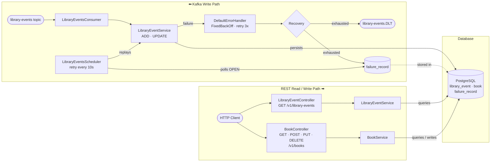

# Implementation Plan
## Library Events Consumer

## What We Are Building

Two independent paths — one driven by Kafka, one by HTTP — sharing the same PostgreSQL database.

| Path | Trigger | Writes | Reads |
|---|---|---|---|
| **Kafka write** | Message on `library-events` | `library_event`, `book`, `failure_record` | — |
| **REST** | HTTP request | `book` only (via `BookController`) | `library_event`, `book` |

---

## Table of Contents

- [What We Are Building](#what-we-are-building)
- [1. Objective](#1-objective)
- [2. Planning Assumptions](#2-planning-assumptions)
- [3. Execution-Order Implementation Roadmap](#3-execution-order-implementation-roadmap)
  - [Step 1: Kafka Consumer + Configuration](#step-1-kafka-consumer--configuration--start-here)
  - [Step 2: DTO + Deserialization](#step-2-dto--deserialization)
  - [Step 3: Kafka Under the Hood](#step-3-kafka-under-the-hood)
  - [Step 4: StringDeserializer vs JsonDeserializer](#step-4-stringdeserializer-vs-jsondeserializer)
  - [Step 5: Consumer Groups and Consumer Offset Management](#step-5-consumer-groups-and-consumer-offset-management)
  - [Step 6: Tasks - Business Logic](#step-6-tasks---business-logic)
    - [Tasks — Flyway Migration](#tasks--flyway-migration)
    - [Tasks — Entity Updates](#tasks--entity-updates-after-migration-is-applied)
    - [Tasks — Business Logic](#tasks--business-logic)
    - [Tasks — Validation](#tasks--validation)
  - [Step 7: Integration Test to Ensure Save is Working](#step-7-integration-test-to-ensure-save-is-working)
- [4. Testing Strategy](#4-testing-strategy)
  - [4.1 Unit Tests](#41-unit-tests)
  - [4.2 Integration Tests](#42-integration-tests)
  - [4.3 Repository Tests](#43-repository-tests)
  - [4.4 Minimum Acceptance Test Matrix](#44-minimum-acceptance-test-matrix)
- [5. Execution Sequence Summary](#5-execution-sequence-summary)
- [6. Definition of Done](#6-definition-of-done)

