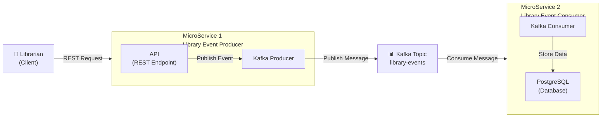

# Library Inventory Architecture

## Understanding the Domain First

Before diving into the technical architecture, let's understand the business domain we're working with.

### The Domain: Library Management System

Our domain is a **Library Management System** where:

- 📚 **Books are added** to the library inventory
- ✏️ **Books are updated** with new information (title, author, etc.)
- 🗑️ **Books may be deleted** from the inventory
- 📊 **Inventory changes** are tracked and managed

### The Primary Actor: The Librarian 👤

The most important actor in this system is the **Librarian**.

The librarian is the person who interacts with the system to manage the library's inventory.

Think from a **business perspective**, not a technical one:

- A librarian **adds a new book** to the collection
- A librarian **updates book details** (correcting information, updating editions)
- A librarian **removes a book** from the system

### Business Events, Not Just Data

Each of these actions becomes a **Library Event**.

This is a crucial distinction:

> **We are not just sending data.**  
> **We are representing business events in the system.**

When a librarian adds a book, we don't just store data—we capture that this **event happened**.

This event-driven approach means:
- **Every action has meaning** in the business context
- **Events are immutable** - they represent what happened
- **Events can be replayed** to reconstruct the state of the system
- **Multiple systems can react** to the same business event

### Library Event Types

In our system, we have different types of library events:

| Event Type | Business Action | Technical Representation |
|------------|----------------|-------------------------|
| **ADD** | Librarian adds a new book | `libraryEventType: ADD` |
| **UPDATE** | Librarian updates book details | `libraryEventType: UPDATE` |

Each event contains:
- **Library Event ID**: Unique identifier for the event
- **Library Event Type**: The type of action (ADD/UPDATE)
- **Book Details**: The actual book information (ID, name, author)

### How Events Flow Through the System

Now that we understand the domain, let's see how these business events flow through our Kafka-based architecture:

1. **Librarian** performs an action (add/update a book)
2. **Action becomes an event** with business meaning
3. **Event is published** to Kafka for other services to consume
4. **Consumer services** react to the event and update their own data stores

This architecture ensures that the **business events** drive the system, not just technical data transfers.

---

## System Architecture Diagram

## Architecture Components

### 1. **Client Layer**
- **Librarian**: External client/user that initiates requests

### 2. **MicroService 1 - Library Event Producer**
- **API**: REST endpoint to receive library events
  - Accepts POST/PUT requests for library events
  - Validates incoming data
  - Returns responses to client
  
- **Kafka Producer**: 
  - Publishes validated events to Kafka topic
  - Ensures message delivery to the topic

### 3. **Message Broker**
- **Kafka Topic (library-events)**:
  - Central message hub for event distribution
  - Decouples producer and consumer services
  - Ensures asynchronous communication

### 4. **MicroService 2 - Library Event Consumer**
- **Kafka Consumer**: 
  - Subscribes to library-events topic
  - Receives published events
  - Processes events asynchronously
  
- **PostgreSQL Database**:
  - Stores processed library events
  - Maintains data persistence
  - Supports queries on stored events

## Data Flow

1. **Librarian** sends a REST request to **MicroService 1**
2. **API** receives and validates the request
3. **Kafka Producer** publishes the validated event to the **library-events** topic
4. **Kafka Consumer** (MicroService 2) receives the message from the topic
5. **PostgreSQL** stores the processed event data

## Key Benefits

- **Decoupling**: Services communicate through Kafka, not directly
- **Asynchronous Processing**: Producer doesn't wait for consumer response
- **Scalability**: Multiple consumers can subscribe to the same topic
- **Reliability**: Message broker ensures no data loss
- **Data Persistence**: PostgreSQL provides permanent storage

## Technology Stack

| Component | Technology |
|-----------|-----------|
| API Framework | Spring Boot |
| Message Broker | Apache Kafka |
| Database | PostgreSQL |
| Serialization | JSON |

