# Kafka Template Guide

## Table of Contents

- [Overview](#overview)
- [What is KafkaTemplate?](#what-is-kafkatemplate)
  - [Key Characteristics](#key-characteristics)
- [How KafkaTemplate Works](#how-kafkatemplate-works)
  - [Basic Flow](#basic-flow)
- [Common KafkaTemplate Methods](#common-kafkatemplate-methods)
  - [1. Asynchronous Send (Non-blocking)](#1-asynchronous-send-non-blocking)
  - [2. Synchronous Send (Blocking)](#2-synchronous-send-blocking)
  - [3. Send with Topic, Key, and Value](#3-send-with-topic-key-and-value)
- [Message Sending Process](#message-sending-process)
- [Thread Model](#thread-model)
  - [Threading Model Diagram](#threading-model-diagram)
  - [Threading Model Flow Explanation](#threading-model-flow-explanation)
    - [1. Application Threads](#1-application-threads)
    - [2. KafkaTemplate (Singleton, Thread-Safe)](#2-kafkatemplate-singleton-thread-safe)
    - [3. Main Thread (Serialization & Batching)](#3-main-thread-serialization--batching)
    - [4. I/O Sender Thread (Network Operations)](#4-io-sender-thread-network-operations)
    - [5. Callback Executor](#5-callback-executor)
    - [Complete End-to-End Threading Flow](#complete-end-to-end-threading-flow)
    - [Thread Safety Guarantees](#thread-safety-guarantees)
    - [Performance Implications](#performance-implications)
- [Deep Dive: What Happens inside KafkaTemplate.send()](#deep-dive-what-happens-inside-kafkatemplate-send)
  - [Step-by-Step Execution Flow](#step-by-step-execution-flow)
  - [1. Serialization Deep Dive](#1-serialization-deep-dive)
  - [2. Partitioning Deep Dive](#2-partitioning-deep-dive)
  - [3. Batching & Buffering Deep Dive](#3-batching--buffering-deep-dive)
  - [4. Compression](#4-compression)
  - [5. Idempotence & Message Ordering](#5-idempotence--message-ordering)
  - [6. Acknowledgment Policies (Acks)](#6-acknowledgment-policies-acks)
  - [7. Retry Mechanism](#7-retry-mechanism)
  - [8. RecordMetadata](#8-recordmetadata)
  - [9. Back Pressure & Flow Control](#9-back-pressure--flow-control)
- [KafkaTemplate in Library Events Producer](#kafkatemplate-in-library-events-producer)
  - [Configuration](#configuration)
  - [Producer Implementation](#producer-implementation)
  - [Key Components](#key-components)
- [Message Key and Value](#message-key-and-value)
  - [Key (Partition Determinant)](#key-partition-determinant)
  - [Value (Actual Message)](#value-actual-message)
  - [Example](#example)
- [Serialization in KafkaTemplate](#serialization-in-kafkatemplate)
  - [What Happens During Serialization](#what-happens-during-serialization)
  - [Serialization Example](#serialization-example)
- [Error Handling and Retries](#error-handling-and-retries)
  - [Producer-Level Retries](#producer-level-retries)
  - [Application-Level Exception Handling](#application-level-exception-handling)
  - [Callback Error Handling](#callback-error-handling)
- [Partitioning Strategy](#partitioning-strategy)
  - [How KafkaTemplate Determines Partition](#how-kafkatemplate-determines-partition)
  - [In Library Events Producer](#in-library-events-producer)
- [Performance Considerations](#performance-considerations)
  - [Batching](#batching)
  - [Buffering](#buffering)
- [Best Practices](#best-practices)
  - [1. Use Dependency Injection](#1-use-dependency-injection)
  - [2. Handle Exceptions Appropriately](#2-handle-exceptions-appropriately)
  - [3. Use Type-Safe Generics](#3-use-type-safe-generics)
  - [4. Log Important Events](#4-log-important-events)
  - [5. Configure Appropriate Timeouts](#5-configure-appropriate-timeouts)
- [KafkaTemplate vs Low-Level Kafka Producer](#kafkatemplate-vs-low-level-kafka-producer)
- [Testing KafkaTemplate](#testing-kafkatemplate)
  - [Using Embedded Kafka](#using-embedded-kafka)
  - [Using MockKafkaTemplate](#using-mockkafkatemplate)
- [Common Issues and Solutions](#common-issues-and-solutions)
- [Visualizing KafkaTemplate with Mermaid Diagrams](#visualizing-kafkatemplate-with-mermaid-diagrams)
  - [Message Flow Diagram](#message-flow-diagram)
  - [Message Partitioning Flow](#message-partitioning-flow)
  - [Batching Timeline Diagram](#batching-timeline-diagram)
  - [Serialization Process Flow](#serialization-process-flow)
  - [Producer State Machine](#producer-state-machine)
  - [Concurrency Model](#concurrency-model)
  - [Error Handling & Retry Flow](#error-handling--retry-flow)
  - [Compression Pipeline](#compression-pipeline)
  - [Configuration Impact Matrix](#configuration-impact-matrix)
  - [Topic & Partition Architecture](#topic--partition-architecture)
  - [Memory Buffer Management](#memory-buffer-management)
  - [Message Journey Through System](#message-journey-through-system)
  - [Decision Tree](#decision-tree)
- [Summary](#summary)
- [Further Reading](#further-reading)
- [Related Files in This Project](#related-files-in-this-project)

## Overview

`KafkaTemplate` is a Spring Framework class that provides a simple abstraction for sending messages to Apache Kafka topics. It's the primary tool used in Spring Kafka applications to publish messages from your application to Kafka brokers.

In the Library Events Producer, `KafkaTemplate` is used to publish library events to the `library-events` Kafka topic.

## What is KafkaTemplate?

`KafkaTemplate` is a Spring Kafka component that:
- Simplifies Kafka producer configuration and management
- Provides methods to send messages synchronously and asynchronously
- Handles serialization of message payloads
- Supports callbacks for success and error handling
- Manages connection pooling and resource cleanup

### Key Characteristics
- **Thread-safe**: Can be safely used across multiple threads
- **Configured via Spring Boot properties**: Easy configuration through `application.yml`
- **Automatic retry handling**: Built-in retry mechanisms for failed sends
- **Type-safe**: Can be parameterized with generic types for type safety

## How KafkaTemplate Works

### Basic Flow

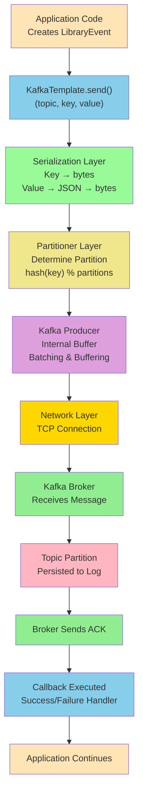


## Common KafkaTemplate Methods

### 1. Asynchronous Send (Non-blocking)
```java
// Returns a CompletableFuture immediately
CompletableFuture<SendResult<Integer, LibraryEvent>> future = 
    kafkaTemplate.send(topic, event);
```

**Pros:**
- Non-blocking
- Higher throughput
- Better performance

**Cons:**
- Must handle success/error callbacks
- More complex error handling

### 2. Synchronous Send (Blocking)
```java
// Returns a CompletableFuture that blocks until message is sent
SendResult<Integer, LibraryEvent> result = 
    kafkaTemplate.send(topic, event).get(3, TimeUnit.SECONDS);
```

**Pros:**
- Guarantees message delivery before method returns
- Simplest to implement
- Easy error handling

**Cons:**
- Blocks the calling thread
- Lower throughput
- Can cause performance issues under high load


### 3. Send with Topic, Key, and Value
```java
// Topic: "library-events"
// Key: 1 (libraryEventId)
// Value: LibraryEvent object
kafkaTemplate.send(topic, 1, libraryEvent);
```

## Message Sending Process

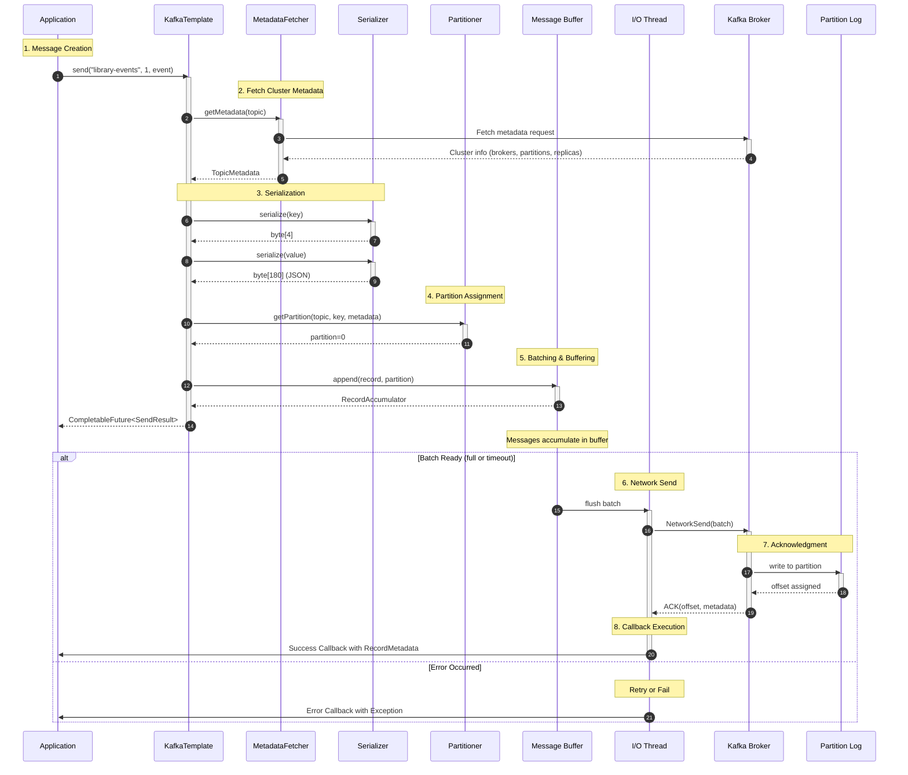


## Thread Model

Understanding how KafkaTemplate handles concurrency and threading is crucial for building high-performance applications.

### Threading Model Diagram

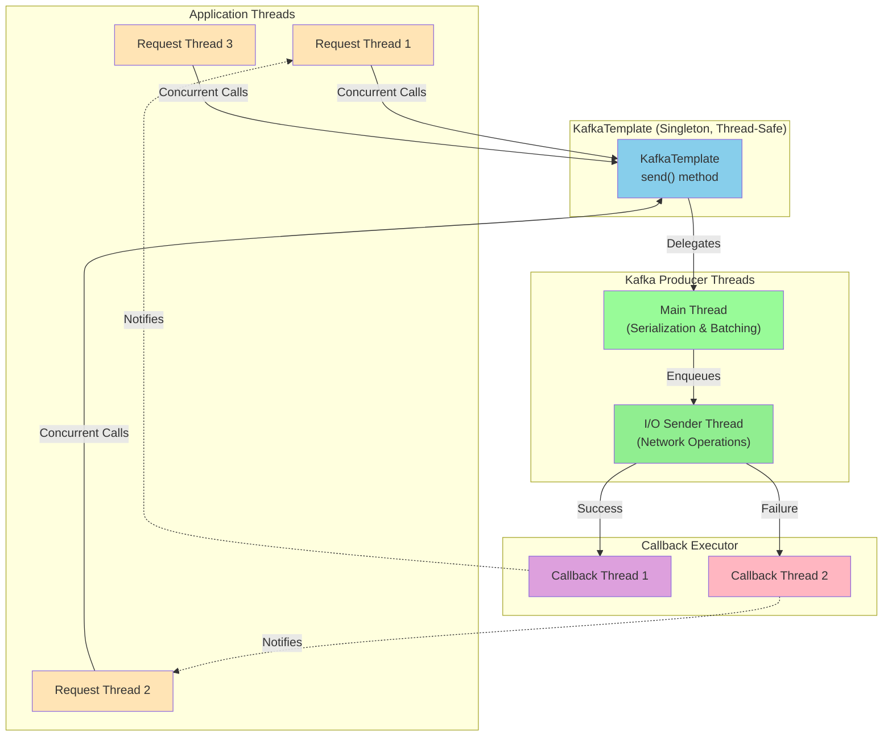

### Threading Model Flow Explanation

#### 1. Application Threads (Request Threads 1-3)

**What they do:**
- Multiple application threads (e.g., HTTP request handlers, service methods) can call `kafkaTemplate.send()` concurrently
- Each thread has its own execution context and doesn't block other threads
- No synchronization overhead at the application level

**Example:**
```java
// Thread 1 (Handling Request A)
kafkaTemplate.send("library-events", 1, eventA);

// Thread 2 (Handling Request B) - Runs concurrently
kafkaTemplate.send("library-events", 2, eventB);

// Thread 3 (Handling Request C) - Runs concurrently
kafkaTemplate.send("library-events", 3, eventC);

// All three threads return immediately!
```

#### 2. KafkaTemplate (Singleton, Thread-Safe)

**What it does:**
- Acts as the central gateway for all send requests
- Implements synchronization internally to handle concurrent calls safely
- Uses locks/atomics to manage shared state without exposing it to the caller
- Returns a `CompletableFuture` immediately without blocking

**Thread-Safety Mechanism:**
```java
// Internally, KafkaTemplate uses synchronization
public CompletableFuture<SendResult<K, V>> send(String topic, K key, V value) {
    // Internal locking ensures thread-safety
    // Application doesn't see the locking overhead
    synchronized(producer) {
        // Prepare message
        // Add to queue
    }
    // Return immediately
    return future;
}
```

**Key Characteristic:**
- **Single Instance Shared Across Threads**: Only one KafkaTemplate bean exists (singleton pattern)
- **No Need for Thread-Local Storage**: All threads use the same instance
- **Efficient Resource Usage**: Avoids creating multiple producer instances

#### 3. Main Thread (Serialization & Batching)

**What it does:**
- Runs in the background as part of the Kafka producer's thread pool
- Receives serialization and batching tasks from KafkaTemplate
- Performs CPU-intensive operations (serialization, compression)
- Accumulates messages into batches

**Operations Performed:**
```
Main Thread Responsibilities:

Input: ProducerRecord objects
    ↓
Step 1: Serialize key
    - Convert Integer key to bytes
    - Example: 1 → [0, 0, 0, 1]
    ↓
Step 2: Serialize value
    - Convert LibraryEvent to JSON
    - Convert JSON string to UTF-8 bytes
    ↓
Step 3: Apply compression (if enabled)
    - Compress serialized bytes
    - Add compression codec header
    ↓
Step 4: Batch accumulation
    - Check if batch is full (batch-size)
    - Check if timeout reached (linger-ms)
    - If condition met, enqueue for I/O thread
    ↓
Output: Batched, serialized, compressed messages
```

**Example Timeline:**
```
T=0ms:   Thread A sends message 1 → Main thread serializes
T=1ms:   Thread B sends message 2 → Main thread serializes
T=2ms:   Thread C sends message 3 → Main thread serializes
T=10ms:  Batch size = 12KB (not full), but linger-ms timeout reached
         → Main thread enqueues batch to I/O thread
```

#### 4. I/O Sender Thread (Network Operations)

**What it does:**
- Handles all network communication with Kafka brokers
- Runs asynchronously to avoid blocking application threads
- Manages TCP connections to brokers
- Implements retry logic for failed sends

**Network Operations:**
```
I/O Thread Responsibilities:

Input: Batched messages from Main thread
    ↓
Step 1: Get broker metadata
    - Which broker is the partition leader?
    - Is connection pool available?
    ↓
Step 2: Establish/reuse TCP connection
    - Connect to broker if not already connected
    - Maintain connection pool
    ↓
Step 3: Send network request
    - Send batched messages over TCP
    - Apply request timeout (request.timeout.ms)
    ↓
Step 4: Wait for broker response
    - Broker processes and writes to log
    - Broker replicates to followers (if configured)
    - Broker sends ACK with metadata
    ↓
Step 5: Handle response
    - Extract offset, partition, timestamp
    - Create RecordMetadata
    - Determine success or failure
    ↓
Output: Callback to be executed
```

**Example Network Flow:**
```
I/O Thread Timeline:

T=0ms:   Batch of 3 messages enqueued
T=5ms:   Connected to Broker 1 (Leader for partition 0)
T=10ms:  Sent 3 messages over network (TCP)
T=15ms:  Broker 1 received messages
T=20ms:  Broker 1 wrote to log
T=25ms:  Broker 1 replicated to Broker 2
T=30ms:  Broker 1 replicated to Broker 3
T=35ms:  All replicas acknowledged
T=40ms:  Broker 1 sends ACK to producer
         - offset: 1234
         - partition: 0
         - timestamp: 1645980000000
T=45ms:  ACK received, callback executor notified
```

#### 5. Callback Executor (Success/Failure Threads)

**What it does:**
- Executes success and failure callbacks registered via `addCallback()`
- Runs in separate thread pools to avoid blocking I/O threads
- Notifies application code of send results
- Allows custom error handling and retries

**Callback Execution Flow:**
```
Success Callback Path:
    I/O Thread receives ACK
        ↓
    Creates RecordMetadata
        ↓
    Enqueues success callback to executor
        ↓
    Callback Thread 1 executes onSuccess()
        ↓
    User code handles success
        └─→ Log, update metrics, store offset, etc.

Failure Callback Path:
    I/O Thread receives error from broker
        ↓
    Extracts error details (timeout, broker error, etc.)
        ↓
    Enqueues failure callback to executor
        ↓
    Callback Thread 2 executes onFailure()
        ↓
    User code handles failure
        └─→ Log error, alert, retry, circuit-break, etc.
```

**Example Callback Execution:**
```java
kafkaTemplate.send("library-events", 1, event)
    .addCallback(
        result -> {
            // This runs in Callback Thread 1 when message succeeds
            log.info("Message published at offset: {}", 
                result.getRecordMetadata().offset());
        },
        ex -> {
            // This runs in Callback Thread 2 when message fails
            log.error("Failed to publish message", ex);
            // Could implement retry logic here
        }
    );

// Application continues immediately
// Callback executes later in background
```

### Complete End-to-End Threading Flow

```
Time    Application Thread    Main Thread           I/O Thread        Callback Thread
────────────────────────────────────────────────────────────────────────────────────
T=0ms   │ send() called      │                      │                 │
         ├─ Returns immediately with CompletableFuture
         │                    │
T=1ms   │ Continue processing (non-blocking!)
         │                    │ Serialize message 1  │                 │
         │                    ├─ Add to batch        │                 │
         │                    │                      │                 │
T=5ms   │ send() called      │ Serialize message 2  │                 │
         ├─ Returns immediately with CompletableFuture
         │ Continue processing (non-blocking!)
         │                    ├─ Add to batch        │                 │
         │                    │ Check batch size     │                 │
         │                    │                      │                 │
T=10ms  │ send() called      │ Batch not full       │                 │
         ├─ Returns immediately with CompletableFuture
         │ Continue processing (non-blocking!)
         │                    ├─ Timeout reached     │                 │
         │                    ├─ Flush batch ────────┤                 │
         │                    │                      ├─ Send to broker │
        │                    │                      │                 │
T=50ms  │                    │                      ├─ Receive ACK    │
        │                    │                      ├─ Enqueue ──────────┤
        │                    │                      │                 ├─ onSuccess()
        │                    │                      │                 │ called
        │                    │                      │                 │
```

**Key Observations:**

1. **Non-Blocking**: Application thread never waits for broker response
2. **Concurrent**: Multiple application threads can send simultaneously
3. **Asynchronous**: All heavy lifting happens in background threads
4. **Efficient**: Batching reduces network overhead
5. **Responsive**: User code continues executing while Kafka operations complete

### Thread Safety Guarantees

| Guarantee | How It's Ensured |
|-----------|------------------|
| **Thread-Safe send()** | Internal synchronization in KafkaTemplate |
| **Concurrent access** | Lock-free data structures for message batching |
| **No race conditions** | Atomic operations on offsets and metadata |
| **Safe callbacks** | Callback executor uses thread pools |
| **Memory visibility** | Volatile fields and happens-before relationships |

### Performance Implications

```yaml
# Threading Configuration (in application.yml)
spring:
  kafka:
    producer:
      # Controls batching (affects Main thread workload)
      batch-size: 16384           # 16 KB
      linger-ms: 10               # 10 ms
      
      # Controls I/O thread behavior
      compression-type: snappy    # Reduces network I/O
      
      # Total memory for buffering across all threads
      buffer-memory: 33554432     # 32 MB
      
      properties:
        # I/O thread timeout
        request.timeout.ms: 30000
        
        # Affects retry behavior in I/O thread
        retry.backoff.ms: 100
```

## Deep Dive: What Happens inside KafkaTemplate.send()

When you call `kafkaTemplate.send(topic, key, value)`, a complex sequence of operations occurs behind the scenes. Understanding this process is crucial for optimizing performance and debugging issues.

### Step-by-Step Execution Flow

```mermaid
flowchart TB
    A["Application calls:<br/>kafkaTemplate.send('library-events', 1, event)"]
    S1["1. INTERCEPT & VALIDATE<br/>- Check if topic exists in metadata<br/>- Validate topic name format<br/>- Check if message is null"]
    S2["2. SERIALIZATION<br/>- Key Serialization: Integer -> bytes<br/>- Input: 1 (Integer)<br/>- Process: IntegerSerializer.serialize()<br/>- Output: [0, 0, 0, 1] (4 bytes)<br/>- Value Serialization: LibraryEvent -> JSON -> bytes<br/>- Input: LibraryEvent object<br/>- Process: JacksonJsonSerializer.serialize()<br/>- Output: {libraryEventId:1,...} -> bytes"]
    S3["3. PARTITIONING<br/>- Determine target partition using partition assignment<br/>- Key-based partitioning: hash(key) % num_partitions<br/>- Result: Partition 0 (in single partition topic)"]
    S4["4. COMPRESSION (if enabled)<br/>- Apply compression codec (snappy/lz4/gzip/zstd)<br/>- Compress serialized bytes<br/>- Store compression type in message header"]
    S5["5. RECORD METADATA & HEADERS<br/>- Attach timestamp (current time)<br/>- Assign sequence number<br/>- Add custom headers (if any)<br/>- Create ProducerRecord object"]
    S6["6. BATCHING & BUFFERING<br/>- Add to accumulated batch for topic-partition<br/>- Check if batch is full (batch-size)<br/>- Check if time limit reached (linger-ms)<br/>- If either condition met -> flush batch<br/>- Otherwise -> wait for more messages"]
    S7["7. BROKER METADATA CHECK<br/>- Verify broker connection is healthy<br/>- Get metadata for partition leader<br/>- Determine which broker to send to<br/>- Maintain broker connection pool"]
    S8["8. SEND TO BROKER<br/>- Create network request with batched messages<br/>- Use producer I/O thread to send asynchronously<br/>- Apply timeout (request.timeout.ms)<br/>- Handle backpressure if broker is slow"]
    S9["9. BROKER PROCESSING<br/>- Broker receives messages<br/>- Validates message format<br/>- Writes to log file (persists to disk)<br/>- Replicates to follower brokers (if configured)<br/>- Applies acks policy"]
    S10["10. ACKNOWLEDGMENT & CALLBACK<br/>- Broker sends back acknowledgment<br/>- Callback executor invokes success/error handler<br/>- Return CompletableFuture with metadata<br/>- Application receives: topic, partition, offset"]
    R["Return to Application"]

    A --> S1 --> S2 --> S3 --> S4 --> S5 --> S6 --> S7 --> S8 --> S9 --> S10 --> R
```

### 1. Serialization Deep Dive

Serialization is the process of converting Java objects into bytes that can be transmitted over the network.

#### Key Serialization Flow
```java
Input Object:
  Integer key = 1

Step 1: Select Serializer
  Configured: IntegerSerializer
  
Step 2: Call serialize(topic, data)
  IntegerSerializer.serialize("library-events", 1)
  
Step 3: Convert to Bytes
  Integer 1 → [0, 0, 0, 1] (4-byte representation in big-endian)
  
Output Bytes: [0, 0, 0, 1]
```

#### Value Serialization Flow
```java
Input Object:
  LibraryEvent {
    libraryEventId: 1,
    libraryEventType: "ADD",
    book: {
      bookId: 10,
      bookName: "Clean Code",
      bookAuthor: "Robert C. Martin"
    }
  }

Step 1: Select Serializer
  Configured: JacksonJsonSerializer
  
Step 2: Convert to JSON String
  {
    "libraryEventId": 1,
    "libraryEventType": "ADD",
    "book": {
      "bookId": 10,
      "bookName": "Clean Code",
      "bookAuthor": "Robert C. Martin"
    }
  }
  
Step 3: Convert JSON String to UTF-8 Bytes
  String → byte[] (UTF-8 encoding)
  
Step 4: Add Headers
  - Serialization format info
  - Content type: application/json
  
Output Bytes: 
  [{json_bytes}, headers_metadata]
  Size: ~180 bytes (typical)
```

#### Serialization Configuration
```yaml
spring:
  kafka:
    producer:
      # Key serializer: converts key type to bytes
      key-serializer: org.apache.kafka.common.serialization.IntegerSerializer
      
      # Value serializer: converts value type to bytes
      value-serializer: org.springframework.kafka.support.serializer.JacksonJsonSerializer
      
      # Additional properties
      properties:
        # Use header to store type information
        spring.json.type.mapping: 
          libraryEvent:com.learnkafka.domain.LibraryEvent
```

#### Custom Serializer Example
```java
public class CustomLibraryEventSerializer 
    implements Serializer<LibraryEvent> {
    
    private ObjectMapper objectMapper = new ObjectMapper();
    
    @Override
    public byte[] serialize(String topic, LibraryEvent event) {
        try {
            // Custom serialization logic
            String json = objectMapper.writeValueAsString(event);
            return json.getBytes(StandardCharsets.UTF_8);
        } catch (JsonProcessingException e) {
            throw new SerializationException("Failed to serialize", e);
        }
    }
    
    @Override
    public void close() {
        // Cleanup resources if needed
    }
}
```

### 2. Partitioning Deep Dive

Partitioning determines which partition receives the message. This is critical for ordering and performance.

#### Partition Assignment Process

```
Input: 
  - Topic: "library-events"
  - Key: 1 (libraryEventId)
  - Number of partitions: 1

Step 1: Hash the Key
  hash(1) = 12345 (deterministic hash function)
  
Step 2: Apply Modulo
  12345 % 1 = 0  (remainder after dividing by partition count)
  
Step 3: Select Partition
  Target Partition = 0
  
Output: Partition 0
```

#### Multi-Partition Example
```
Topic: "library-events" with 3 partitions

Message 1: key=1  → hash(1)=12345 → 12345 % 3 = 0 → Partition 0
Message 2: key=2  → hash(2)=67890 → 67890 % 3 = 0 → Partition 0
Message 3: key=5  → hash(5)=99999 → 99999 % 3 = 0 → Partition 0
Message 4: key=7  → hash(7)=45678 → 45678 % 3 = 0 → Partition 0

Partition Distribution:
  Partition 0: [msg1, msg2, msg3, msg4]  (same key range)
  Partition 1: []
  Partition 2: []
```

#### Custom Partitioner Implementation
```java
public class BookIdPartitioner implements Partitioner {
    
    @Override
    public int partition(String topic, Object key, byte[] keyBytes,
                        Object value, byte[] valueBytes,
                        Cluster cluster) {
        if (key == null) {
            return 0; // Default to partition 0
        }
        
        Integer libraryEventId = (Integer) key;
        
        // Custom logic: even IDs → partition 0, odd IDs → partition 1
        int partitionCount = cluster.partitionsForTopic(topic).size();
        return (libraryEventId % 2) % partitionCount;
    }
    
    @Override
    public void close() {}
    
    @Override
    public void configure(Map<String, ?> configs) {}
}
```

#### Ordering Guarantee
```
Same key → Same partition → Messages are ordered

Partition 0 (ordered for key=1):
  [Offset 0]: LibraryEvent {id: 1, type: ADD, ...}
  [Offset 1]: LibraryEvent {id: 1, type: UPDATE, ...}
  [Offset 2]: LibraryEvent {id: 1, type: DELETE, ...}
  
Consumer reads in order → Maintains event sequence
```

### 3. Batching & Buffering Deep Dive

Batching is the process of accumulating multiple messages before sending them to the broker, improving efficiency and throughput.

#### Batching Process

```
Timeline of Message Arrivals:

T=0ms:   Message 1 arrives (2KB)
         ├─ Add to buffer for partition-0
         ├─ Current batch size: 2KB
         └─ Continue waiting

T=2ms:   Message 2 arrives (3KB)
         ├─ Add to buffer for partition-0
         ├─ Current batch size: 5KB
         └─ Continue waiting

T=5ms:   Message 3 arrives (8KB)
         ├─ Add to buffer for partition-0
         ├─ Current batch size: 13KB
         └─ Continue waiting

T=8ms:   Message 4 arrives (5KB)
         ├─ Add to buffer for partition-0
         ├─ Current batch size: 18KB
         ├─ BATCH SIZE LIMIT REACHED! (18KB > 16KB)
         └─ FLUSH BATCH IMMEDIATELY!
         
         ╔═════════════════════════════════════════╗
         ║ Send 4 messages in one network request  ║
         ║ - Reduced overhead                      ║
         ║ - One TCP round trip instead of 4       ║
         ║ - Better throughput                     ║
         ╚═════════════════════════════════════════╝

T=10ms:  Message 5 arrives (1KB)
         ├─ Add to new batch for partition-0
         ├─ Current batch size: 1KB
         └─ Continue waiting

T=20ms:  LINGER TIME EXCEEDED (10ms timeout reached)
         ├─ Current batch size: 1KB (not full)
         └─ FLUSH BATCH (to avoid excessive latency)
```

#### Batching Configuration Impact

```yaml
spring:
  kafka:
    producer:
      # Batch size in bytes - how much data to accumulate
      batch-size: 16384           # 16 KB
      
      # Linger time in milliseconds - max wait time
      linger-ms: 10               # 10 ms
      
      # Total buffer allocated
      buffer-memory: 33554432     # 32 MB
```

#### Throughput vs Latency Trade-off

```
Low Batch Settings (batch-size: 1024, linger-ms: 1):
  ├─ More frequent flushes
  ├─ Lower latency (faster individual message delivery)
  ├─ More network round trips
  └─ Lower throughput (messages per second)
  
Optimal Settings (batch-size: 16384, linger-ms: 10):
  ├─ Balanced flushing
  ├─ Reasonable latency
  ├─ Efficient batching
  └─ Good throughput
  
High Batch Settings (batch-size: 65536, linger-ms: 100):
  ├─ Less frequent flushes
  ├─ Higher latency (slower individual message delivery)
  ├─ Fewer network round trips
  └─ Higher throughput (more messages per second)
```

#### Memory Buffer Management

```
Total Buffer Memory: 32 MB

Scenario 1: Multiple Topics
  Topic A partition-0: 8 MB
  Topic A partition-1: 8 MB
  Topic B partition-0: 8 MB
  Topic B partition-1: 8 MB
  ─────────────────────────
  Total allocated: 32 MB (fully utilized)

Scenario 2: Slow Broker
  If broker is slow to acknowledge:
  ├─ Accumulates messages in buffer
  ├─ Buffer fills up faster
  ├─ May block send() calls when buffer exhausted
  ├─ Applies backpressure to application
  └─ max.block.ms: how long to wait before throwing exception
     (default: 60 seconds)

Configuration:
spring:
  kafka:
    producer:
      buffer-memory: 33554432      # 32 MB
      max-block-ms: 60000          # 60 seconds
      properties:
        max.block.ms: 60000
```

### 4. Compression

Compression reduces message size before sending to the broker, saving bandwidth and storage.

#### Compression Types

```
No Compression (compression.type: none)
  ├─ Original size: 1000 bytes
  ├─ Compressed size: 1000 bytes
  ├─ CPU overhead: 0%
  └─ Network bandwidth: High

Snappy Compression (compression.type: snappy)
  ├─ Original size: 1000 bytes
  ├─ Compressed size: 600 bytes (40% reduction)
  ├─ CPU overhead: Low
  ├─ Decompression speed: Fast
  └─ Best for: Moderate compression, low latency

LZ4 Compression (compression.type: lz4)
  ├─ Original size: 1000 bytes
  ├─ Compressed size: 550 bytes (45% reduction)
  ├─ CPU overhead: Very Low
  ├─ Decompression speed: Very Fast
  └─ Best for: High throughput, low latency

Gzip Compression (compression.type: gzip)
  ├─ Original size: 1000 bytes
  ├─ Compressed size: 400 bytes (60% reduction)
  ├─ CPU overhead: High
  ├─ Decompression speed: Moderate
  └─ Best for: Maximum compression, can tolerate CPU usage

ZSTD Compression (compression.type: zstd)
  ├─ Original size: 1000 bytes
  ├─ Compressed size: 350 bytes (65% reduction)
  ├─ CPU overhead: Low
  ├─ Decompression speed: Very Fast
  └─ Best for: Maximum compression with low overhead
```

#### Compression Configuration

```yaml
spring:
  kafka:
    producer:
      compression-type: snappy    # snappy | lz4 | gzip | zstd | none
```

#### Compression Example Flow

```
Original JSON Message (180 bytes):
{
  "libraryEventId": 1,
  "libraryEventType": "ADD",
  "book": {
    "bookId": 10,
    "bookName": "Clean Code",
    "bookAuthor": "Robert C. Martin"
  }
}

After Compression (snappy):
[Binary data representing compressed JSON]
Size: 120 bytes (33% reduction)
Compression Header: snappy codec metadata

Network Transmission:
- Send 120 bytes instead of 180 bytes
- Save ~25% bandwidth
- Consumer auto-decompresses on receipt
```

### 5. Idempotence & Message Ordering

Kafka can guarantee exactly-once delivery at the broker level with proper configuration.

#### Idempotent Producer Configuration

```yaml
spring:
  kafka:
    producer:
      acks: all                          # Wait for all replicas
      retries: 2147483647               # Retry indefinitely
      properties:
        enable.idempotence: true          # Enable idempotence
        max.in.flight.requests.per.connection: 5
```

#### How Idempotence Works

```
Message Send Attempt 1:
  ├─ Broker receives message
  ├─ Assigns sequence number: 0
  ├─ Assigns offset: 100
  └─ Sends ACK

Message Send Attempt 2 (retry due to timeout):
  ├─ Producer sends same message with sequence: 0
  ├─ Broker detects duplicate (same producer ID + sequence)
  ├─ Broker doesn't duplicate, returns same offset: 100
  └─ Consumer never sees duplicate!
```

### 6. Acknowledgment Policies (Acks)

Controls when producer considers a message "sent" based on broker replication.

#### Acks Configuration

```yaml
spring:
  kafka:
    producer:
      acks: all  # Possible values: 0, 1, all, -1
```

#### Acks Behavior

| Acks Value | Behavior | Latency | Durability |
|-----------|----------|---------|-----------|
| **0** (none) | Producer doesn't wait for ACK | Very Low | Very Low - broker crash loses data |
| **1** (leader) | Wait for leader ACK only | Low | Medium - replica crash loses data |
| **all** / **-1** | Wait for all replicas ACK | High | Very High - survives broker failure |

#### Acks Flow Example

```
acks=all (Replication factor=3):

Producer sends message
    ↓
Broker 1 (Leader) receives
    ├─ Writes to log
    ├─ Replicates to Broker 2
    ├─ Replicates to Broker 3
    ↓ (once all write successfully)
Broker 1 sends ACK to Producer
    ↓
Producer receives ACK → Message considered "sent"

Durability: Message survives up to 2 broker failures!
```

### 7. Retry Mechanism

Handles transient failures like broker unavailability.

#### Retry Configuration

```yaml
spring:
  kafka:
    producer:
      retries: 2147483647          # Nearly infinite retries
      properties:
        retry.backoff.ms: 100      # Wait 100ms between retries
        request.timeout.ms: 30000  # 30 second timeout
```

#### Retry Flow

```
Attempt 1: Send message
    ↓
Broker unreachable (network error)
    ↓
Wait 100ms (retry.backoff.ms)
    ↓
Attempt 2: Send message
    ↓
Broker responds with error
    ↓
Wait 100ms
    ↓
Attempt 3: Send message
    ↓
Success → ACK received
    ↓
Message delivered (after retries)
```

### 8. RecordMetadata

Information returned after successful send, available in callback.

```java
future.addCallback(
    result -> {
        RecordMetadata metadata = result.getRecordMetadata();
        
        // Available metadata:
        String topic = metadata.topic();           // "library-events"
        int partition = metadata.partition();       // 0
        long offset = metadata.offset();           // 12345
        long timestamp = metadata.timestamp();     // System time
        int serializedKeySize = metadata.serializedKeySize();   // 4
        int serializedValueSize = metadata.serializedValueSize(); // 180
    },
    ex -> {
        // Handle error
    }
);
```

### 9. Back Pressure & Flow Control

Prevents producer from overwhelming the broker.

```
Normal Flow:
  Producer sends → Buffer → Broker processes → Producer continues
  
Slow Broker Flow:
  Producer sends → Buffer fills → Backpressure applied
    ↓
  send() call blocks (waits for buffer space)
    ↓
  Application thread pauses
    ↓
  Broker catches up → Buffer space freed
    ↓
  send() returns → Application continues
    
Timeout:
  If broker too slow, send() throws exception after max.block.ms
```

## KafkaTemplate in Library Events Producer

### Configuration

In `application.yml`:
```yaml
spring:
  kafka:
    bootstrap-servers: localhost:9092
    producer:
      key-serializer: org.apache.kafka.common.serialization.IntegerSerializer
      value-serializer: org.springframework.kafka.support.serializer.JacksonJsonSerializer
```

### Producer Implementation

```java
@Component
public class LibraryEventProducer {
    
    @Autowired
    private KafkaTemplate<Integer, LibraryEvent> kafkaTemplate;
    
    @Value("${library.events.topic}")
    private String topic;
    
    public void sendLibraryEvent(LibraryEvent event) throws JsonProcessingException {
        // Send message with event ID as key and event as value
        kafkaTemplate.send(topic, event.getLibraryEventId(), event);
    }
}
```

### Key Components

| Component | Purpose |
|-----------|---------|
| `KafkaTemplate<Integer, LibraryEvent>` | Generic type specifies key type (Integer) and value type (LibraryEvent) |
| `bootstrap-servers` | Kafka broker address for initial connection |
| `key-serializer` | Converts Integer keys to bytes |
| `value-serializer` | Converts LibraryEvent objects to JSON bytes |

## Message Key and Value

### Key (Partition Determinant)
- **Purpose**: Used to determine which partition the message goes to
- **Format**: Integer (libraryEventId in this project)
- **Behavior**: Messages with the same key always go to the same partition
- **Use Case**: Ensures events for the same library item stay ordered

### Value (Actual Message)
- **Purpose**: The actual data being published
- **Format**: LibraryEvent object (serialized to JSON)
- **Content**: Library event details including book information

### Example
```java
// Message key: 123 (libraryEventId)
// Message value: {"libraryEventId": 123, "libraryEventType": "ADD", "book": {...}}
kafkaTemplate.send("library-events", 123, libraryEvent);
```

## Serialization in KafkaTemplate

### What Happens During Serialization

1. **Key Serialization**: `IntegerSerializer` converts Integer → bytes
2. **Value Serialization**: `JacksonJsonSerializer` converts LibraryEvent -> JSON -> bytes

### Serialization Example
```
Input:
LibraryEvent {
    libraryEventId: 1,
    libraryEventType: ADD,
    book: {
        bookId: 10,
        bookName: "Clean Code",
        bookAuthor: "Robert C. Martin"
    }
}

After Serialization (JSON):
{
    "libraryEventId": 1,
    "libraryEventType": "ADD",
    "book": {
        "bookId": 10,
        "bookName": "Clean Code",
        "bookAuthor": "Robert C. Martin"
    }
}

Final (Bytes):
[123, 34, 108, 105, 98, 114, 97, 114, 121, ...]
```

## Error Handling and Retries

### Producer-Level Retries
Configured in Kafka producer properties:
```yaml
spring:
  kafka:
    producer:
      retries: 3
      retry-backoff-ms: 100
```

### Application-Level Exception Handling
```java
try {
    kafkaTemplate.send(topic, key, event).get(3, TimeUnit.SECONDS);
} catch (InterruptedException | ExecutionException | TimeoutException e) {
    log.error("Failed to send message after retries", e);
    // Handle error - return 500 response, log, alert, etc.
}
```

### Callback Error Handling
```java
future.addCallback(
    result -> log.info("Success: {}", result.getRecordMetadata()),
    ex -> {
        log.error("Failed: {}", ex.getMessage());
        // Could retry, update status, alert, etc.
    }
);
```

## Partitioning Strategy

### How KafkaTemplate Determines Partition

1. **If Key is provided**: 
   - Kafka uses the key to determine partition
   - Same key → same partition (preserves order)
   - Formula: `hash(key) % num_partitions`

2. **If Key is null**:
   - Round-robin across partitions
   - No order guarantee

### In Library Events Producer
- **Key**: `libraryEventId`
- **Benefit**: All events for the same library item go to the same partition
- **Guarantees**: Order preserved for events with the same library ID

```
LibraryEventId 1 → Partition 0
LibraryEventId 2 → Partition 0  (if only 1 partition)
LibraryEventId 3 → Partition 0
```

## Performance Considerations

### Batching
KafkaTemplate batches messages to improve throughput:
```yaml
spring:
  kafka:
    producer:
      batch-size: 16384      # Batch size in bytes
      linger-ms: 10          # Wait up to 10ms to batch messages
```

- **Larger batches**: Higher throughput, higher latency
- **Smaller batches**: Lower latency, lower throughput

### Buffering
```yaml
spring:
  kafka:
    producer:
      buffer-memory: 33554432  # Total buffer memory
      compression-type: snappy
```

## Best Practices

### 1. Use Dependency Injection
```java
@Component
public class MyProducer {
    @Autowired
    private KafkaTemplate<Integer, MyEvent> kafkaTemplate;
}
```
✅ Spring manages the bean lifecycle and connection pooling

### 2. Handle Exceptions Appropriately
```java
// ✅ Good: Handle both success and failure
future.addCallback(
    result -> handleSuccess(result),
    ex -> handleFailure(ex)
);

// ❌ Bad: Silently ignore failures
kafkaTemplate.send(topic, message);
```

### 3. Use Type-Safe Generics
```java
// ✅ Good: Type-safe
KafkaTemplate<Integer, LibraryEvent> kafkaTemplate;

// ❌ Bad: Not type-safe
KafkaTemplate kafkaTemplate;
```

### 4. Log Important Events
```java
future.addCallback(
    result -> log.info("Message published: topic={}, partition={}, offset={}",
        result.getRecordMetadata().topic(),
        result.getRecordMetadata().partition(),
        result.getRecordMetadata().offset()),
    ex -> log.error("Failed to publish message", ex)
);
```

### 5. Configure Appropriate Timeouts
```java
try {
    result = kafkaTemplate.send(topic, key, value)
        .get(10, TimeUnit.SECONDS);  // Don't wait forever
} catch (TimeoutException e) {
    log.error("Message send timeout", e);
}
```

## KafkaTemplate vs Low-Level Kafka Producer

### KafkaTemplate (Recommended for Spring Apps)
✅ Spring integration
✅ Automatic configuration
✅ Exception handling
✅ Thread-safe
✅ Cleaner API
✅ Callback support

### Low-Level KafkaProducer
✅ More control
✅ Less overhead
❌ Manual configuration
❌ Manual resource management
❌ More code to write

## Testing KafkaTemplate

### Using Embedded Kafka
```java
@SpringBootTest
@EmbeddedKafka(partitions = 1, topics = "library-events")
class LibraryEventsProducerTest {
    
    @Autowired
    private KafkaTemplate<Integer, LibraryEvent> kafkaTemplate;
    
    @Test
    void testSendMessage() throws Exception {
        LibraryEvent event = new LibraryEvent(1, LibraryEventType.ADD, book);
        
        SendResult<Integer, LibraryEvent> result = 
            kafkaTemplate.send("library-events", 1, event).get();
        
        assertEquals("library-events", result.getRecordMetadata().topic());
    }
}
```

### Using MockKafkaTemplate
```java
@SpringBootTest
class LibraryEventsControllerTest {
    
    @MockBean
    private KafkaTemplate<Integer, LibraryEvent> kafkaTemplate;
    
    @Test
    void testControllerWithMockedKafka() {
        // Mock the send behavior
        when(kafkaTemplate.send(anyString(), anyInt(), any(LibraryEvent.class)))
            .thenReturn(CompletableFuture.completedFuture(null));
        
        // Test controller logic
    }
}
```

## Common Issues and Solutions

### Issue 1: Serialization Error
```
Error: Cannot serialize object to JSON
```
**Solution**: Ensure your model has getter/setter methods or is annotated with `@Data`

### Issue 2: Message Not Reaching Broker
```
Error: Message silently fails
```
**Solution**: Always add callback or use `.get()` to wait for result

### Issue 3: Out of Memory
```
Error: java.lang.OutOfMemoryError
```
**Solution**: Reduce `buffer-memory` or `batch-size` settings

### Issue 4: Slow Performance
```
Issue: High latency
```
**Solution**: Increase `batch-size` and `linger-ms` for higher throughput

## Visualizing KafkaTemplate with Mermaid Diagrams

Mermaid is a JavaScript-based diagramming and charting tool that helps visualize complex concepts. Here are several diagrams that illustrate KafkaTemplate operations:

### Message Flow Diagram

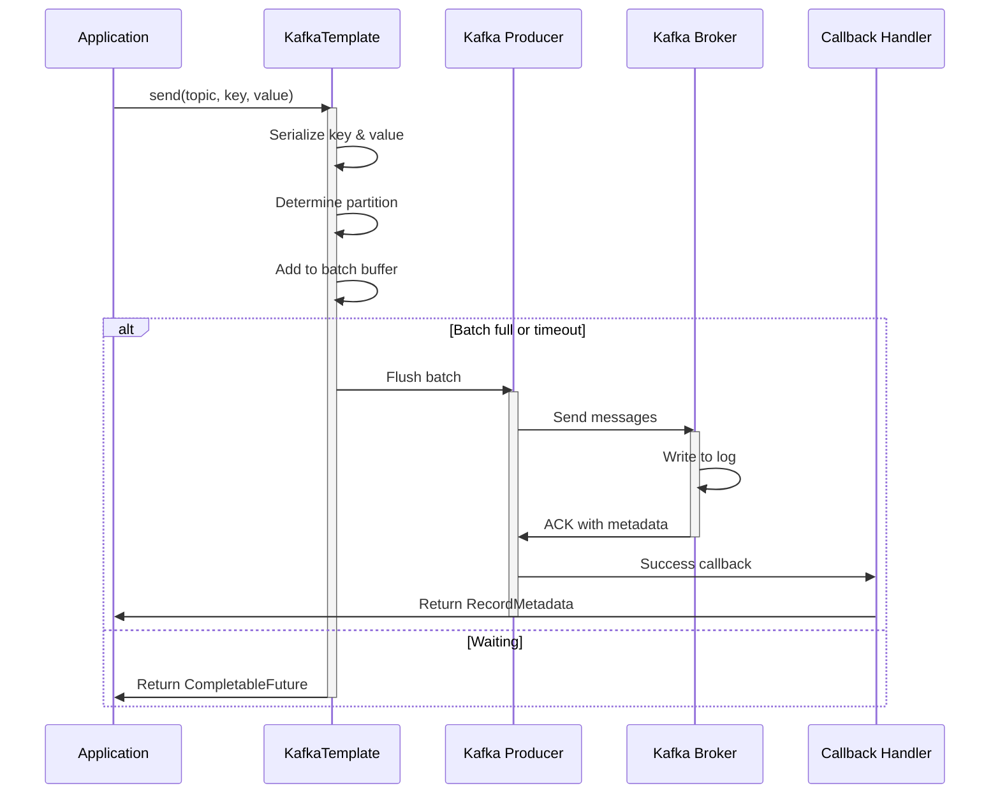

### Message Partitioning Flow

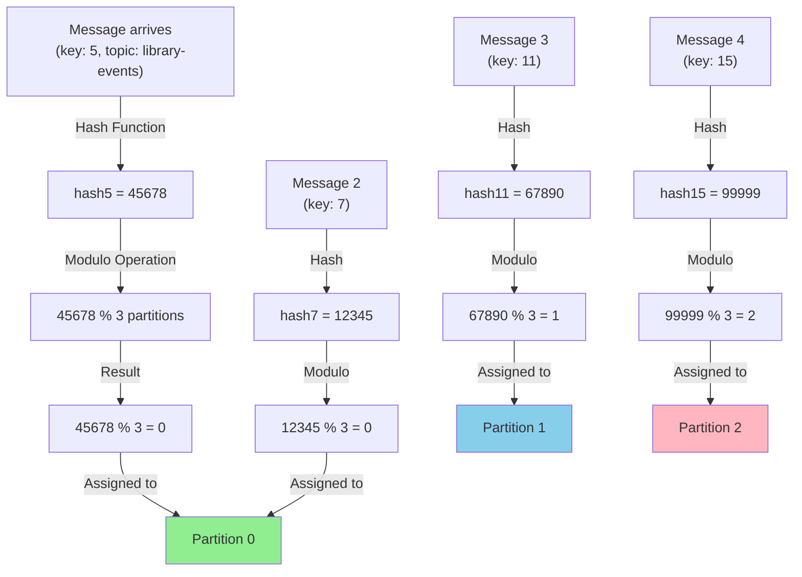

### Batching Timeline Diagram

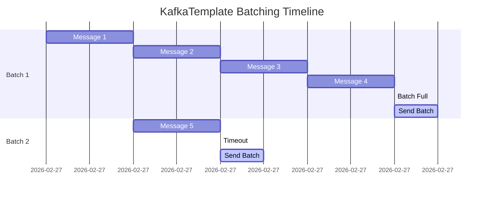

### Serialization Process Flow

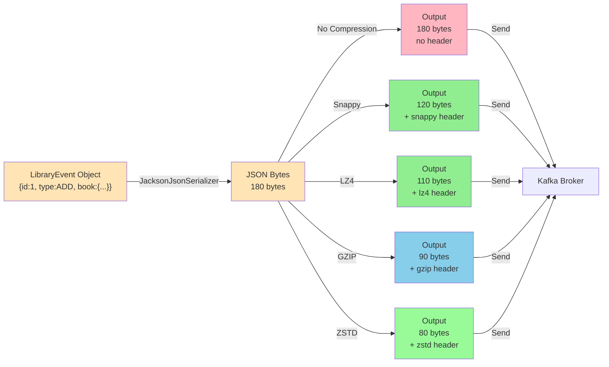

### Producer State Machine

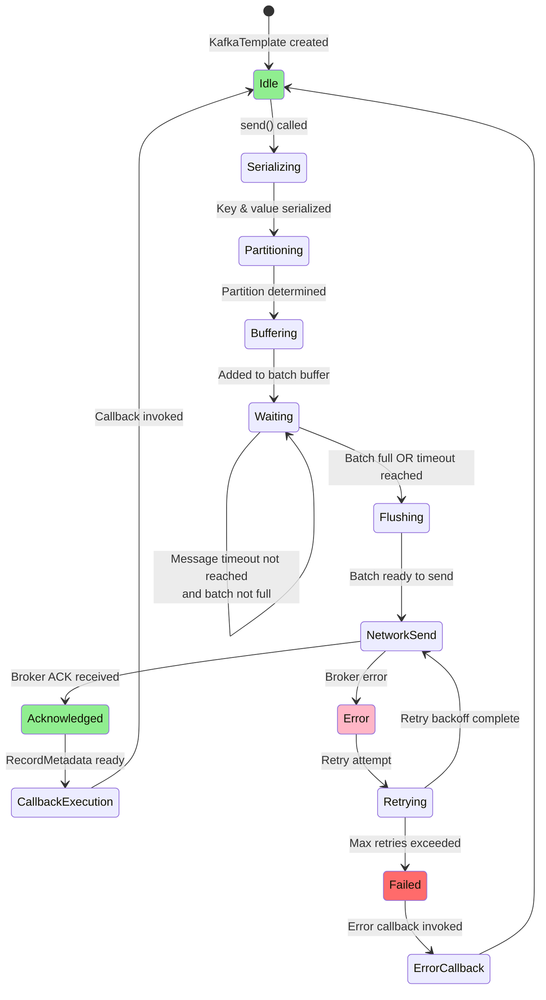

### Concurrency Model

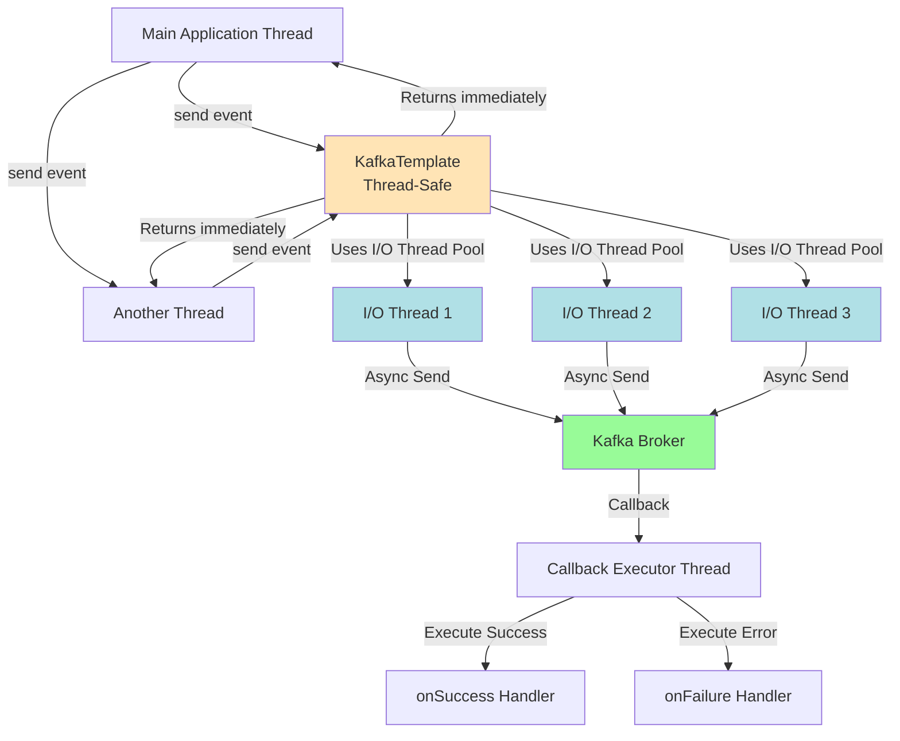

### Error Handling & Retry Flow

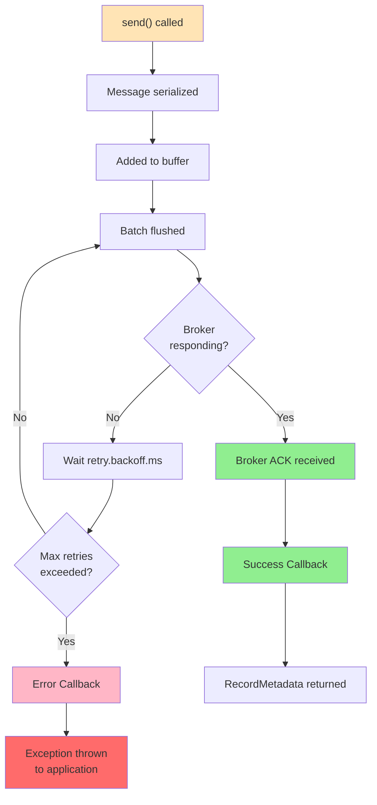

### Compression Pipeline

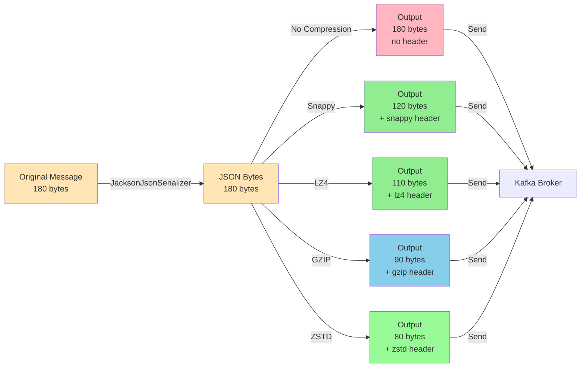

### Configuration Impact Matrix

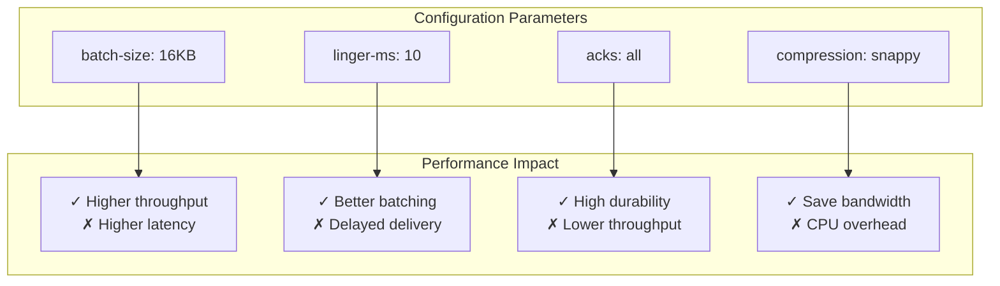

### Topic & Partition Architecture

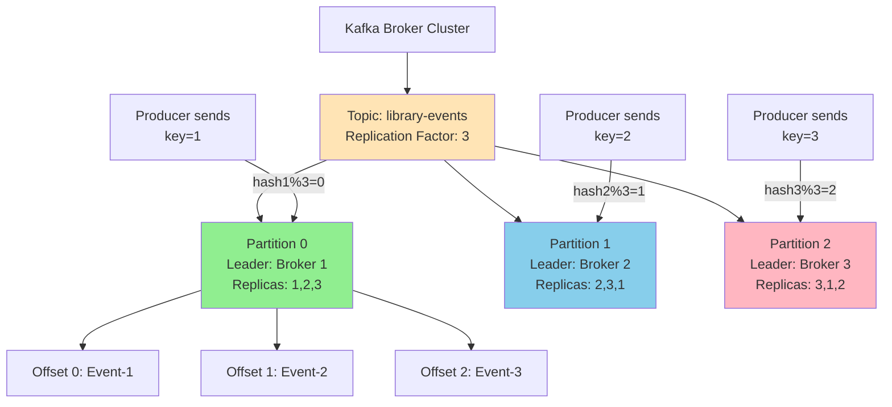

### Memory Buffer Management

```mermaid
graph TB
    A["Total Buffer Memory: 32MB"]

    A --> B["Per-Partition Buffers"]

    B --> C["Topic A - Partition 0<br/>8MB"]
    B --> D["Topic A - Partition 1<br/>8MB"]
    B --> E["Topic B - Partition 0<br/>8MB"]
    B --> F["Topic B - Partition 1<br/>8MB"]

    G["Slow Broker"] -->|Accumulates| C
    H["Fast Send Rate"] -->|Fills Buffer"] C

    C -->|Buffer Full| I["Backpressure Applied<br/>send() blocks"]
    I -->|Broker Catches Up| J["Buffer Drained<br/>send() resumes"]

    style C fill:#FFB6C6
    style I fill:#FF6B6B
    style J fill:#90EE90
```

### Message Journey Through System

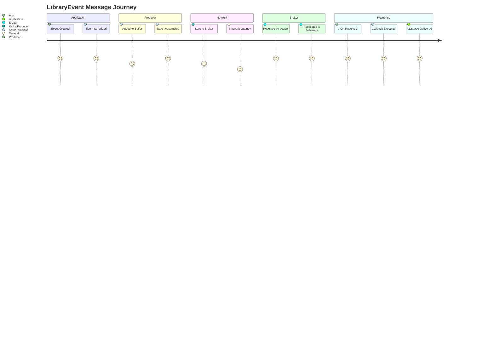

### Decision Tree: When to Use What?

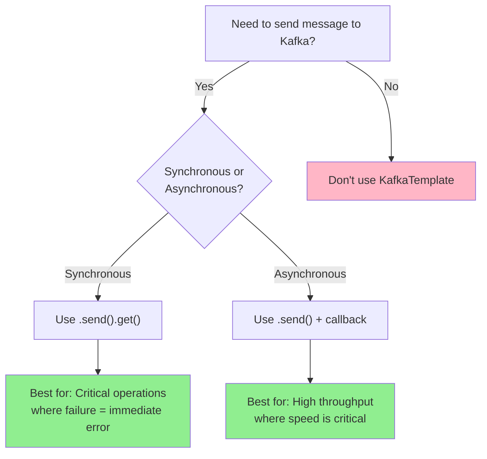

## Summary

| Feature | Description |
|---------|-------------|
| **Purpose** | Simplifies sending messages to Kafka |
| **Type Safety** | Supports generic types for keys and values |
| **Configuration** | Configured via Spring Boot properties |
| **Async Support** | Non-blocking message sending with callbacks |
| **Error Handling** | Built-in retry and exception handling |
| **Partitioning** | Uses message key to determine partition |
| **Serialization** | Automatic serialization of objects to bytes |
| **Thread Safety** | Safe to use across multiple threads |

## Further Reading

- [Spring Kafka Documentation](https://spring.io/projects/spring-kafka)
- [Apache Kafka Documentation](https://kafka.apache.org/documentation/)
- [KafkaTemplate API Reference](https://docs.spring.io/spring-kafka/docs/current/api/org/springframework/kafka/core/KafkaTemplate.html)

## Related Files in This Project

- `src/main/java/com/learnkafka/producer/LibraryEventProducer.java` - Producer implementation
- `src/main/resources/application.yml` - KafkaTemplate configuration
- `src/test/java/com/learnkafka/controller/LibraryEventsControllerIntegrationTest.java` - Integration tests with embedded Kafka
