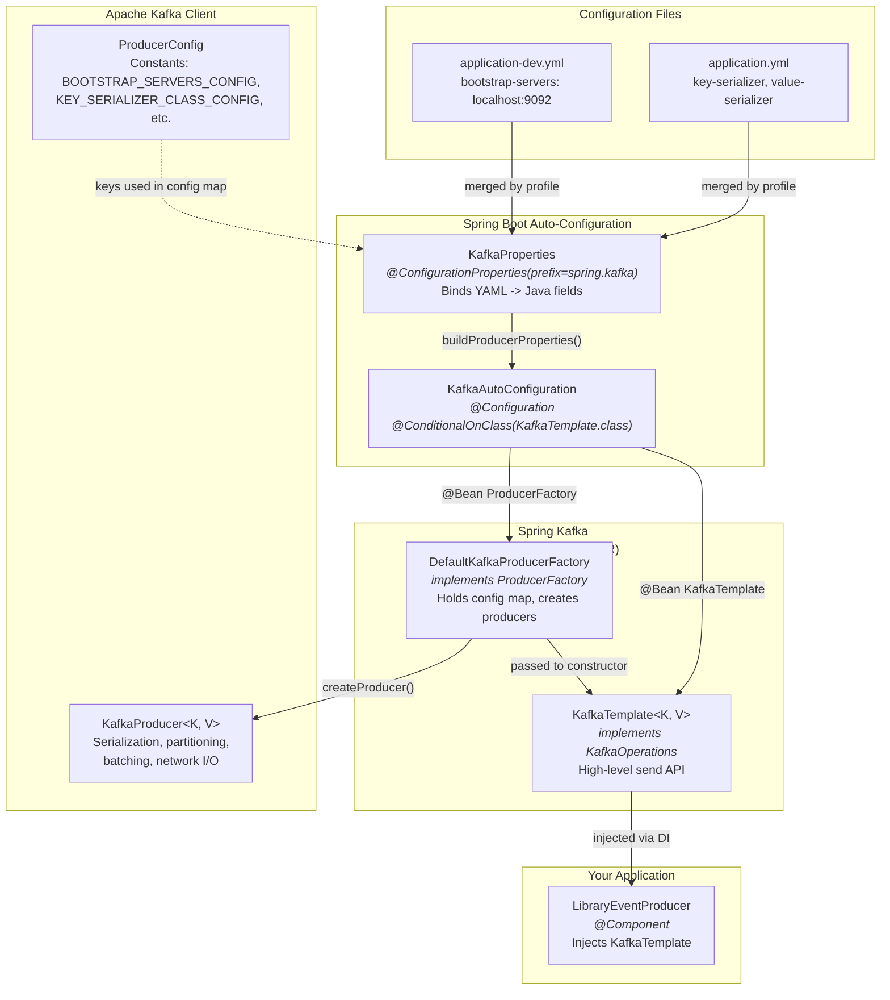

# Kafka Auto Configuration in Spring Boot - Complete Flow

This document explains how Kafka Auto Configuration works in Spring Boot, from reading properties in `application.yml` to making `KafkaTemplate` available for dependency injection.

## Table of Contents
1. [Overview](#overview)
2. [Configuration Flow](#configuration-flow)
3. [How Spring Kafka Auto-Configures the KafkaTemplate](#how-spring-kafka-auto-configures-the-kafkatemplate)
   - [The application.yml — Where It All Starts](#the-applicationyml--where-it-all-starts)
   - [Key Spring Kafka Classes Involved](#key-spring-kafka-classes-involved)
   - [Step-by-Step Auto-Configuration Flow](#step-by-step-auto-configuration-flow)
   - [Auto-Configuration Flow Diagram](#auto-configuration-flow-diagram)
   - [How the Classes Wire Together — Mermaid Diagram](#how-the-classes-wire-together--mermaid-diagram)
   - [What Happens If You Override the Auto-Configuration?](#what-happens-if-you-override-the-auto-configuration)
   - [Quick Reference: Property → Class → Bean Mapping](#quick-reference-property--class--bean-mapping)
4. [Step-by-Step Process](#step-by-step-process)
5. [Your Project Example](#your-project-example)
6. [Key Classes Involved](#key-classes-involved)
7. [How It All Works Together](#how-it-all-works-together)

---

## Overview

Spring Boot's **Auto Configuration** is a powerful mechanism that automatically configures Spring beans based on:
- Dependencies on the classpath
- Properties defined in configuration files
- Conditional logic

For Kafka, when you add `spring-boot-starter-kafka` dependency, Spring Boot automatically:
1. Reads Kafka configuration from `application.yml`
2. Creates and configures necessary beans (ProducerFactory, KafkaTemplate, etc.)
3. Makes them available for dependency injection

---

## Configuration Flow

```
application.yml
       ↓
KafkaProperties (Binding)
       ↓
KafkaAutoConfiguration (Auto-config class)
       ↓
ProducerFactory Bean Creation
       ↓
KafkaTemplate Bean Creation
       ↓
Dependency Injection (Your Code)
```

---

## How Spring Kafka Auto-Configures the KafkaTemplate

Now that we've seen the high-level configuration flow, the next question is: **how does Spring Boot create and configure the `KafkaTemplate` in the first place?** You never write `new KafkaTemplate(...)` yourself - Spring Boot's auto-configuration handles this by reading your `application.yml` files.

### The application.yml — Where It All Starts

In this project, the Kafka-related configuration lives across multiple YAML files:

**`application.yml` (base config)**
```yaml
spring:
  kafka:
    producer:
      key-serializer: org.apache.kafka.common.serialization.IntegerSerializer
      value-serializer: org.springframework.kafka.support.serializer.JacksonJsonSerializer
```

**`application-dev.yml` (dev profile)**
```yaml
spring:
  kafka:
    bootstrap-servers: localhost:9092
```

**`application-prod.yml` (prod profile)**
```yaml
spring:
  kafka:
    bootstrap-servers: kafka.prod.com:9092
```

Spring Boot merges these files based on the active profile (`spring.profiles.active: dev`), producing an effective configuration like:

```yaml
spring:
  kafka:
    bootstrap-servers: localhost:9092
    producer:
      key-serializer: org.apache.kafka.common.serialization.IntegerSerializer
      value-serializer: org.springframework.kafka.support.serializer.JacksonJsonSerializer
```

### Key Spring Kafka Classes Involved

Here are the main classes that participate in auto-configuring the `KafkaTemplate`, listed in the order they come into play:

| #  | Class                            | Package / JAR                           | Role                                                                                     |
|----|----------------------------------|-----------------------------------------|------------------------------------------------------------------------------------------|
| 1  | `KafkaProperties`                | `spring-boot-autoconfigure`             | A `@ConfigurationProperties` class that **binds** all `spring.kafka.*` properties from YAML into a strongly-typed Java object. |
| 2  | `KafkaAutoConfiguration`         | `spring-boot-autoconfigure`             | The **main auto-configuration class**. Annotated with `@ConditionalOnClass(KafkaTemplate.class)` - only activates when Spring Kafka is on the classpath. |
| 3  | `DefaultKafkaProducerFactory`    | `spring-kafka`                          | The **ProducerFactory** implementation. Holds the producer configuration map and is responsible for creating `KafkaProducer` instances. |
| 4  | `KafkaTemplate`                  | `spring-kafka`                          | The **high-level API** your code injects. Delegates to the `ProducerFactory` to obtain a `KafkaProducer` and send messages. |
| 5  | `KafkaProducer`                  | `kafka-clients` (Apache Kafka)          | The **actual low-level Kafka client** that handles serialization, partitioning, batching, network I/O, and acknowledgments. |
| 6  | `ProducerConfig`                 | `kafka-clients` (Apache Kafka)          | A constants class (`BOOTSTRAP_SERVERS_CONFIG`, `KEY_SERIALIZER_CLASS_CONFIG`, etc.) used as keys in the configuration map. |

### Step-by-Step Auto-Configuration Flow

Here is exactly what happens when your Spring Boot application starts:

#### Step 1 — Classpath Scanning

When you include `spring-boot-starter-kafka` in your `build.gradle`:

```groovy
implementation 'org.springframework.boot:spring-boot-starter'
implementation 'org.springframework.kafka:spring-kafka'
```

Spring Boot detects `KafkaTemplate.class` on the classpath. This satisfies the `@ConditionalOnClass` condition on `KafkaAutoConfiguration`, so it activates.

#### Step 2 — Property Binding via `KafkaProperties`

`KafkaAutoConfiguration` is annotated with `@EnableConfigurationProperties(KafkaProperties.class)`, which tells Spring Boot to:

1. Instantiate a `KafkaProperties` object.
2. Bind every property under the `spring.kafka` prefix to it.

```java
@ConfigurationProperties(prefix = "spring.kafka")
public class KafkaProperties {

    private List<String> bootstrapServers;          // <- spring.kafka.bootstrap-servers

    private final Producer producer = new Producer();

    public static class Producer {
        private Class<?> keySerializer;             // <- spring.kafka.producer.key-serializer
        private Class<?> valueSerializer;           // <- spring.kafka.producer.value-serializer
        private String acks;                        // <- spring.kafka.producer.acks
        private Integer retries;                    // <- spring.kafka.producer.retries
        // ... many more fields
    }

    /**
     * Converts the bound properties into a flat Map<String, Object>
     * that can be passed directly to the Kafka client.
     */
    public Map<String, Object> buildProducerProperties() {
        Map<String, Object> props = new HashMap<>();
        props.put(ProducerConfig.BOOTSTRAP_SERVERS_CONFIG, this.bootstrapServers);
        if (this.producer.keySerializer != null)
            props.put(ProducerConfig.KEY_SERIALIZER_CLASS_CONFIG, this.producer.keySerializer);
        if (this.producer.valueSerializer != null)
            props.put(ProducerConfig.VALUE_SERIALIZER_CLASS_CONFIG, this.producer.valueSerializer);
        // ... remaining properties
        return props;
    }
}
```

For **this project**, the resulting map looks like:

```java
{
    "bootstrap.servers"  : "localhost:9092",
    "key.serializer"     : "org.apache.kafka.common.serialization.IntegerSerializer",
    "value.serializer"   : "org.springframework.kafka.support.serializer.JacksonJsonSerializer"
}
```

#### Step 3 — `ProducerFactory` Bean Creation

`KafkaAutoConfiguration` defines a `@Bean` method that creates a `DefaultKafkaProducerFactory` **only if** no other `ProducerFactory` bean exists (`@ConditionalOnMissingBean`):

```java
@Bean
@ConditionalOnMissingBean(ProducerFactory.class)
public DefaultKafkaProducerFactory<?, ?> kafkaProducerFactory(
        KafkaProperties properties) {

    // Convert YAML properties -> Map<String, Object>
    Map<String, Object> producerProps = properties.buildProducerProperties();

    // Create the factory that will produce KafkaProducer instances
    return new DefaultKafkaProducerFactory<>(producerProps);
}
```

Internally, `DefaultKafkaProducerFactory` stores the config map and creates the actual Apache Kafka `KafkaProducer` lazily (on first `send()` call):

```java
public class DefaultKafkaProducerFactory<K, V> implements ProducerFactory<K, V> {

    private final Map<String, Object> configs;

    @Override
    public Producer<K, V> createProducer() {
        return new KafkaProducer<>(this.configs);   // <- Apache Kafka client
    }
}
```

#### Step 4 — `KafkaTemplate` Bean Creation

Next, `KafkaAutoConfiguration` creates the `KafkaTemplate` bean, passing the `ProducerFactory` from Step 3:

```java
@Bean
@ConditionalOnMissingBean(KafkaTemplate.class)
public KafkaTemplate<?, ?> kafkaTemplate(
        ProducerFactory<Object, Object> kafkaProducerFactory,
        ProducerListener<Object, Object> kafkaProducerListener) {

    KafkaTemplate<Object, Object> template =
        new KafkaTemplate<>(kafkaProducerFactory);
    template.setProducerListener(kafkaProducerListener);
    return template;
}
```

At this point, the `KafkaTemplate` bean is fully configured and sitting in the Spring application context.

#### Step 5 — Dependency Injection into Your Code

Spring injects the auto-configured `KafkaTemplate` wherever it's needed. In this project, that's `LibraryEventProducer`:

```java
@Component
public class LibraryEventProducer {

    private final KafkaTemplate<Integer, LibraryEvent> kafkaTemplate;
    private final String topicName;

    public LibraryEventProducer(
            KafkaTemplate<Integer, LibraryEvent> kafkaTemplate,      // <- Auto-configured bean
            @Value("${library.events.topic:library-events}") String topicName) {
        this.kafkaTemplate = kafkaTemplate;
        this.topicName = topicName;
    }
}
```

### Auto-Configuration Flow Diagram

```
┌───────────────────────────────────────────────────────────────────┐
│  application.yml  +  application-dev.yml  (merged by profile)     │
│                                                                   │
│  spring.kafka.bootstrap-servers = localhost:9092                   │
│  spring.kafka.producer.key-serializer = IntegerSerializer         │
│  spring.kafka.producer.value-serializer = JacksonJsonSerializer   │
└──────────────────────────┬────────────────────────────────────────┘
                           ↓
┌───────────────────────────────────────────────────────────────────┐
│  KafkaProperties  (@ConfigurationProperties)                      │
│                                                                   │
│  • Binds spring.kafka.* -> strongly-typed fields                  │
│  • buildProducerProperties() -> Map<String, Object>               │
└──────────────────────────┬────────────────────────────────────────┘
                           ↓
┌───────────────────────────────────────────────────────────────────┐
│  KafkaAutoConfiguration  (@Configuration)                         │
│                                                                   │
│  @ConditionalOnClass(KafkaTemplate.class)  <- spring-kafka on CP │
│  @EnableConfigurationProperties(KafkaProperties.class)            │
└────────────┬─────────────────────────────┬────────────────────────┘
             ↓                             ↓
┌─────────────────────────┐   ┌──────────────────────────────┐
│  DefaultKafkaProducer-  │   │  KafkaTemplate               │
│  Factory  @Bean         │-->|  @Bean                       │
│                         │   │                              │
│  Holds producer config  │   │  High-level send() API       │
│  Creates KafkaProducer  │   │  Delegates to ProducerFactory│
└─────────────────────────┘   └──────────────┬───────────────┘
                                             ↓
┌───────────────────────────────────────────────────────────────────┐
│  LibraryEventProducer                                             │
│  (@Component)                                                     │
│                                                                   │
│  Injects KafkaTemplate via                                        │
│  constructor injection                                            │
└───────────────────────────────────────────────────────────────────┘
```

### How the Classes Wire Together — Mermaid Diagram



### What Happens If You Override the Auto-Configuration?

Because every auto-configured bean is guarded by `@ConditionalOnMissingBean`, you can replace any part of the chain:

| What You Define                        | What Auto-Config Skips                            |
|----------------------------------------|---------------------------------------------------|
| Your own `ProducerFactory` `@Bean`     | Auto-config **will not** create its `ProducerFactory` |
| Your own `KafkaTemplate` `@Bean`       | Auto-config **will not** create its `KafkaTemplate`   |
| Both                                   | Auto-config backs off entirely for the producer side  |

**Example - Custom `ProducerFactory` with additional config:**

```java
@Configuration
public class CustomKafkaConfig {

    @Bean
    public ProducerFactory<Integer, LibraryEvent> producerFactory() {
        Map<String, Object> props = new HashMap<>();
        props.put(ProducerConfig.BOOTSTRAP_SERVERS_CONFIG, "localhost:9092");
        props.put(ProducerConfig.KEY_SERIALIZER_CLASS_CONFIG, IntegerSerializer.class);
        props.put(ProducerConfig.VALUE_SERIALIZER_CLASS_CONFIG, JacksonJsonSerializer.class);
        props.put(ProducerConfig.ACKS_CONFIG, "all");
        props.put(ProducerConfig.RETRIES_CONFIG, 10);
        props.put(ProducerConfig.ENABLE_IDEMPOTENCE_CONFIG, true);
        return new DefaultKafkaProducerFactory<>(props);
    }
}
```

When Spring Boot sees that a `ProducerFactory` bean already exists, it skips its own factory creation but **still** creates the `KafkaTemplate` (using your factory) - because `KafkaTemplate` is still missing.

### Quick Reference: Property → Class → Bean Mapping

```
application.yml property                   KafkaProperties field              ProducerConfig constant                    Final config map key
-----------------------------------------  ---------------------------------  -----------------------------------------  -------------------------
spring.kafka.bootstrap-servers             bootstrapServers                   BOOTSTRAP_SERVERS_CONFIG                   "bootstrap.servers"
spring.kafka.producer.key-serializer       producer.keySerializer             KEY_SERIALIZER_CLASS_CONFIG                "key.serializer"
spring.kafka.producer.value-serializer     producer.valueSerializer           VALUE_SERIALIZER_CLASS_CONFIG              "value.serializer"
spring.kafka.producer.acks                 producer.acks                      ACKS_CONFIG                                "acks"
spring.kafka.producer.retries              producer.retries                   RETRIES_CONFIG                             "retries"
spring.kafka.producer.batch-size           producer.batchSize                 BATCH_SIZE_CONFIG                          "batch.size"
spring.kafka.producer.buffer-memory        producer.bufferMemory              BUFFER_MEMORY_CONFIG                       "buffer.memory"
spring.kafka.producer.compression-type     producer.compressionType           COMPRESSION_TYPE_CONFIG                    "compression.type"
spring.kafka.producer.properties.*         producer.properties                (passed through as-is)                     (property key as-is)
```

> **Key Takeaway:** You write human-friendly YAML -> `KafkaProperties` binds it -> `buildProducerProperties()` converts it to the flat `Map<String, Object>` that Apache Kafka's `KafkaProducer` expects -> `DefaultKafkaProducerFactory` holds that map -> `KafkaTemplate` uses the factory. The entire chain is created and wired automatically by `KafkaAutoConfiguration`.

---

## Step-by-Step Process

### Step 1: Add Kafka Starter Dependency

In your `build.gradle`:
```groovy
dependencies {
    implementation 'org.springframework.boot:spring-boot-starter-kafka'
}
```

This dependency includes:
- `spring-kafka` - Core Spring Kafka library
- `kafka-clients` - Apache Kafka client library
- Auto-configuration classes

### Step 2: Define Properties in application.yml

Your `application.yml`:
```yaml
spring:
  kafka:
    bootstrap-servers: localhost:9092
    producer:
      key-serializer: org.apache.kafka.common.serialization.IntegerSerializer
      value-serializer: org.springframework.kafka.support.serializer.JacksonJsonSerializer
```

### Step 3: Spring Boot Reads Properties

When Spring Boot starts, it:
1. **Scans** the classpath for auto-configuration classes
2. **Finds** `KafkaAutoConfiguration` (from spring-boot-autoconfigure)
3. **Binds** properties from `application.yml` to `KafkaProperties` class

#### KafkaProperties Class (Spring Framework)
```java
@ConfigurationProperties(prefix = "spring.kafka")
public class KafkaProperties {
    private List<String> bootstrapServers = new ArrayList<>();
    private Producer producer = new Producer();
    
    public static class Producer {
        private String keySerializer;
        private String valueSerializer;
        // ... other properties
    }
}
```

The `@ConfigurationProperties` annotation binds all properties under `spring.kafka` prefix to this class.

### Step 4: Auto Configuration Creates Beans

#### KafkaAutoConfiguration Class (Simplified View)

Spring Boot includes this auto-configuration class:

```java
@Configuration
@ConditionalOnClass(KafkaTemplate.class)
@EnableConfigurationProperties(KafkaProperties.class)
@Import({
    KafkaAnnotationDrivenConfiguration.class,
    KafkaStreamsAnnotationDrivenConfiguration.class
})
public class KafkaAutoConfiguration {

    private final KafkaProperties properties;

    public KafkaAutoConfiguration(KafkaProperties properties) {
        this.properties = properties;
    }

    @Configuration
    @ConditionalOnClass(KafkaTemplate.class)
    @ConditionalOnMissingBean(ProducerFactory.class)
    protected static class ProducerConfiguration {

        @Bean
        public ProducerFactory<?, ?> kafkaProducerFactory(KafkaProperties properties) {
            DefaultKafkaProducerFactory<?, ?> factory = 
                new DefaultKafkaProducerFactory<>(
                    properties.buildProducerProperties()
                );
            return factory;
        }

        @Bean
        @ConditionalOnMissingBean(KafkaTemplate.class)
        public KafkaTemplate<?, ?> kafkaTemplate(ProducerFactory<Object, Object> kafkaProducerFactory) {
            KafkaTemplate<Object, Object> kafkaTemplate = 
                new KafkaTemplate<>(kafkaProducerFactory);
            return kafkaTemplate;
        }
    }
}
```

**Key Annotations:**
- `@ConditionalOnClass(KafkaTemplate.class)` - Only activates if KafkaTemplate is on classpath
- `@EnableConfigurationProperties(KafkaProperties.class)` - Enables binding of properties
- `@ConditionalOnMissingBean` - Only creates bean if user hasn't defined their own

### Step 5: Building Producer Properties

The `KafkaProperties.buildProducerProperties()` method converts your YAML config to a Map:

```java
public Map<String, Object> buildProducerProperties() {
    Map<String, Object> props = new HashMap<>();
    
    // Bootstrap servers
    props.put(ProducerConfig.BOOTSTRAP_SERVERS_CONFIG, this.bootstrapServers);
    
    // Serializers
    if (this.producer.keySerializer != null) {
        props.put(ProducerConfig.KEY_SERIALIZER_CLASS_CONFIG, 
                  this.producer.keySerializer);
    }
    if (this.producer.valueSerializer != null) {
        props.put(ProducerConfig.VALUE_SERIALIZER_CLASS_CONFIG, 
                  this.producer.valueSerializer);
    }
    
    // Other producer configs...
    return props;
}
```

This creates a Map like:
```java
{
    "bootstrap.servers": "localhost:9092",
    "key.serializer": "org.apache.kafka.common.serialization.IntegerSerializer",
    "value.serializer": "org.springframework.kafka.support.serializer.JacksonJsonSerializer"
}
```

### Step 6: ProducerFactory Creation

The `DefaultKafkaProducerFactory` is created with the producer properties:

```java
public class DefaultKafkaProducerFactory<K, V> implements ProducerFactory<K, V> {
    
    private final Map<String, Object> configs;
    
    public DefaultKafkaProducerFactory(Map<String, Object> configs) {
        this.configs = configs;
    }
    
    @Override
    public Producer<K, V> createProducer() {
        // Creates actual KafkaProducer from Apache Kafka library
        return new KafkaProducer<>(this.configs);
    }
}
```

### Step 7: KafkaTemplate Creation

`KafkaTemplate` is created using the `ProducerFactory`:

```java
public class KafkaTemplate<K, V> implements KafkaOperations<K, V> {
    
    private final ProducerFactory<K, V> producerFactory;
    
    public KafkaTemplate(ProducerFactory<K, V> producerFactory) {
        this.producerFactory = producerFactory;
    }
    
    public CompletableFuture<SendResult<K, V>> send(String topic, V data) {
        Producer<K, V> producer = producerFactory.createProducer();
        // Send message...
    }
}
```

### Step 8: Dependency Injection

Now `KafkaTemplate` is available in the Spring context and can be injected:

```java
@Component
public class LibraryEventProducer {
    private final KafkaTemplate<Integer, LibraryEvent> kafkaTemplate;
    
    // Spring automatically injects the auto-configured KafkaTemplate
    public LibraryEventProducer(KafkaTemplate<Integer, LibraryEvent> kafkaTemplate) {
        this.kafkaTemplate = kafkaTemplate;
    }
}
```

---

## Your Project Example

### Configuration in application.yml
```yaml
spring:
  kafka:
    bootstrap-servers: localhost:9092
    producer:
      key-serializer: org.apache.kafka.common.serialization.IntegerSerializer
      value-serializer: org.springframework.kafka.support.serializer.JacksonJsonSerializer

library:
  events:
    topic: library-events
```

### How It Gets Used

**1. Spring Boot Starts:**
   - Detects `spring-boot-starter-kafka` on classpath
   - Activates `KafkaAutoConfiguration`

**2. Properties Binding:**
   ```
   spring.kafka.bootstrap-servers → KafkaProperties.bootstrapServers
   spring.kafka.producer.key-serializer → KafkaProperties.producer.keySerializer
   spring.kafka.producer.value-serializer → KafkaProperties.producer.valueSerializer
   ```

**3. Bean Creation:**
   ```
   ProducerFactory<Integer, LibraryEvent> [Bean created with config]
           ↓
   KafkaTemplate<Integer, LibraryEvent> [Bean created with ProducerFactory]
           ↓
   LibraryEventProducer [Injected with KafkaTemplate]
   ```

**4. Your Code:**
   ```java
   @Component
   public class LibraryEventProducer {
       private final KafkaTemplate<Integer, LibraryEvent> kafkaTemplate;
       
       public LibraryEventProducer(
           KafkaTemplate<Integer, LibraryEvent> kafkaTemplate,
           @Value("${library.events.topic}") String topicName) {
           this.kafkaTemplate = kafkaTemplate; // Auto-configured bean injected here
           this.topicName = topicName;
       }
       
       public CompletableFuture<SendResult<Integer, LibraryEvent>> sendLibraryEvent(
           LibraryEvent libraryEvent) {
           return kafkaTemplate.send(topicName, libraryEvent);
       }
   }
   ```

---

## Key Classes Involved

### Spring Boot Auto Configuration Classes

1. **`KafkaAutoConfiguration`**
   - Location: `spring-boot-autoconfigure` JAR
   - Purpose: Main auto-configuration class
   - Creates: ProducerFactory and KafkaTemplate beans

2. **`KafkaProperties`**
   - Location: `spring-boot-autoconfigure` JAR
   - Purpose: Binds properties from application.yml
   - Prefix: `spring.kafka`

### Spring Kafka Core Classes

3. **`ProducerFactory<K, V>`** (Interface)
   - Purpose: Factory to create Kafka Producer instances
   - Implementation: `DefaultKafkaProducerFactory`

4. **`KafkaTemplate<K, V>`**
   - Purpose: High-level API for sending messages
   - Uses: ProducerFactory to get Producer instances

5. **`DefaultKafkaProducerFactory<K, V>`**
   - Purpose: Default implementation of ProducerFactory
   - Creates: Apache Kafka's `KafkaProducer` instances

### Apache Kafka Classes

6. **`KafkaProducer<K, V>`**
   - Location: `kafka-clients` JAR
   - Purpose: Actual Kafka producer that sends messages to broker

7. **`ProducerConfig`**
   - Purpose: Constants for producer configuration keys
   - Examples: `BOOTSTRAP_SERVERS_CONFIG`, `KEY_SERIALIZER_CLASS_CONFIG`

---

## How It All Works Together

### Complete Flow Diagram

```
┌─────────────────────────────────────────────────────────────────┐
│ 1. Application Startup                                          │
└────────────────────────────┬────────────────────────────────────┘
                             ↓
┌─────────────────────────────────────────────────────────────────┐
│ 2. Classpath Scanning                                           │
│    - Finds spring-boot-starter-kafka dependency                 │
│    - Detects KafkaAutoConfiguration class                       │
└────────────────────────────┬────────────────────────────────────┘
                             ↓
┌─────────────────────────────────────────────────────────────────┐
│ 3. Property Binding                                             │
│    application.yml → KafkaProperties object                     │
│                                                                 │
│    spring.kafka.bootstrap-servers → KafkaProperties.bootstrapServers
│    spring.kafka.producer.key-serializer → KafkaProperties.producer.keySerializer
│    spring.kafka.producer.value-serializer → KafkaProperties.producer.valueSerializer
│                                                                 │
│    spring.kafka.producer.acks → KafkaProperties.producer.acks
│    spring.kafka.producer.retries → KafkaProperties.producer.retries
│    spring.kafka.producer.batch-size → KafkaProperties.producer.batchSize
│    spring.kafka.producer.buffer-memory → KafkaProperties.producer.bufferMemory
│    spring.kafka.producer.compression-type → KafkaProperties.producer.compressionType
│    spring.kafka.producer.properties.* → KafkaProperties.producer.properties
└────────────────────────────┬────────────────────────────────────┘
                             ↓
┌─────────────────────────────────────────────────────────────────┐
│ 4. Build Producer Configuration Map                             │
│    KafkaProperties.buildProducerProperties()                    │
│                                                                 │
│    Map<String, Object> {                                        │
│      "bootstrap.servers": "localhost:9092",                     │
│      "key.serializer": "...IntegerSerializer",                  │
│      "value.serializer": "...JacksonJsonSerializer"             │
│    }                                                            │
└────────────────────────────┬────────────────────────────────────┘
                             ↓
┌─────────────────────────────────────────────────────────────────┐
│ 5. Create ProducerFactory Bean                                  │
│    @Bean                                                        │
│    public ProducerFactory kafkaProducerFactory() {              │
│      return new DefaultKafkaProducerFactory(configMap);         │
│    }                                                            │
└────────────────────────────┬────────────────────────────────────┘
                             ↓
┌─────────────────────────────────────────────────────────────────┐
│ 6. Create KafkaTemplate Bean                                    │
│    @Bean                                                        │
│    public KafkaTemplate kafkaTemplate(ProducerFactory pf) {     │
│      return new KafkaTemplate(pf);                              │
│    }                                                            │
└────────────────────────────┬────────────────────────────────────┘
                             ↓
┌─────────────────────────────────────────────────────────────────┐
│ 7. Dependency Injection                                         │
│    @Component                                                   │
│    public class LibraryEventProducer {                          │
│      public LibraryEventProducer(KafkaTemplate kt) {            │
│        this.kafkaTemplate = kt; // ← Injected here             │
│      }                                                          │
│    }                                                            │
└─────────────────────────────────────────────────────────────────┘
```

---

## Conditional Configuration

The auto-configuration is smart and only activates when conditions are met:

### Example Conditions:

```java
@ConditionalOnClass(KafkaTemplate.class)
```
- Only runs if `KafkaTemplate` class is present on classpath
- If you remove `spring-kafka` dependency, this won't activate

```java
@ConditionalOnMissingBean(KafkaTemplate.class)
```
- Only creates `KafkaTemplate` bean if you haven't defined your own
- Allows you to override with custom configuration

```java
@ConditionalOnProperty(prefix = "spring.kafka", name = "bootstrap-servers")
```
- Only activates if specific property is defined
- Ensures configuration is present before creating beans

---

## Customizing Auto Configuration

You can override or customize the auto-configuration:

### Option 1: Override Properties

```yaml
spring:
  kafka:
    bootstrap-servers: localhost:9092
    producer:
      key-serializer: org.apache.kafka.common.serialization.IntegerSerializer
      value-serializer: org.springframework.kafka.support.serializer.JacksonJsonSerializer
      acks: all
      retries: 3
      compression-type: snappy
```

### Option 2: Define Your Own Bean

```java
@Configuration
public class KafkaConfig {
    
    @Bean
    public ProducerFactory<Integer, LibraryEvent> producerFactory() {
        Map<String, Object> configProps = new HashMap<>();
        configProps.put(ProducerConfig.BOOTSTRAP_SERVERS_CONFIG, "localhost:9092");
        configProps.put(ProducerConfig.KEY_SERIALIZER_CLASS_CONFIG, IntegerSerializer.class);
        configProps.put(ProducerConfig.VALUE_SERIALIZER_CLASS_CONFIG, JacksonJsonSerializer.class);
        // Custom configuration...
        return new DefaultKafkaProducerFactory<>(configProps);
    }
    
    @Bean
    public KafkaTemplate<Integer, LibraryEvent> kafkaTemplate() {
        return new KafkaTemplate<>(producerFactory());
    }
}
```

When you define your own beans, Spring Boot's auto-configuration backs off due to `@ConditionalOnMissingBean`.

---

## Property Resolution Order

Spring Boot resolves properties in this order (highest to lowest priority):

1. Command line arguments: `--spring.kafka.bootstrap-servers=localhost:9092`
2. Java System properties: `System.setProperty("spring.kafka.bootstrap-servers", "...")`
3. OS environment variables: `SPRING_KAFKA_BOOTSTRAP_SERVERS=localhost:9092`
4. `application.yml` or `application.properties` in the application
5. Default values in `@ConfigurationProperties` classes

---

## Summary

The Kafka Auto Configuration flow:

1. **Add Dependency** → `spring-boot-starter-kafka`
2. **Define Properties** → `application.yml` under `spring.kafka`
3. **Property Binding** → Spring binds to `KafkaProperties` class
4. **Auto Configuration Runs** → `KafkaAutoConfiguration` creates beans
5. **ProducerFactory Created** → With configuration from properties
6. **KafkaTemplate Created** → Using ProducerFactory
7. **Dependency Injection** → KafkaTemplate available in your code
8. **Runtime** → Use KafkaTemplate to send messages

**Key Benefits:**
- ✅ Zero boilerplate configuration code
- ✅ Type-safe property binding
- ✅ Easy to override or customize
- ✅ Follows Spring Boot conventions
- ✅ Production-ready defaults

**You get a fully configured KafkaTemplate just by:**
1. Adding the dependency
2. Setting a few properties in YAML
3. Injecting it in your code

That's the magic of Spring Boot Auto Configuration! 🎉

