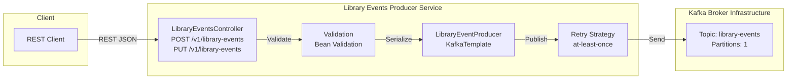

# Architecture Diagram: Library Events Producer API

## Production/Development Architecture



## Testing Architecture

```mermaid
flowchart TB
  subgraph Testing["Integration Testing Layer"]
    T1[LibraryEventsControllerIntegrationTest]
    T2[@SpringBootTest<br/>@AutoConfigureMockMvc<br/>@EmbeddedKafka]
  end

  subgraph Service2[Library Events Producer Service]
    B2[LibraryEventsController]
    C2[Validation]
    D2[LibraryEventProducer]
  end

  subgraph EmbeddedKafka["Embedded Kafka<br/>In-Memory Broker"]
    F2[library-events Topic<br/>Partitions: 1]
  end

  T1 -->|Triggers Tests| T2
  T2 -->|MockMvc Requests| B2
  B2 -->|Validates| C2
  C2 -->|Produces| D2
  D2 -->|Publishes| F2
  F2 -->|Assertions| T2
```

## System Components

### API Layer
- **LibraryEventsController**: REST endpoint handler
  - `POST /v1/library-events`: Create new library event (ADD type)
  - `PUT /v1/library-events`: Update existing library event (UPDATE type)

### Service Layer
- **LibraryEventProducer**: Kafka producer for publishing events
  - Uses `KafkaTemplate` for message publishing
  - Implements retry strategy (at-least-once semantics)
  - Serializes events to JSON format

### Validation
- Bean validation annotations for request validation
- Rejects invalid libraryEventType or missing required fields
- Validates Book properties (bookId, bookName, bookAuthor)

### Kafka Infrastructure
- **Topic**: `library-events`
- **Partitions**: 1 (for development/testing)
- **Serialization**: JSON (IntegerSerializer for keys, JsonSerializer for values)

### Testing
- **@SpringBootTest**: Full application context loading
- **@AutoConfigureMockMvc**: MockMvc for HTTP testing without actual HTTP calls
- **@EmbeddedKafka**: In-memory Kafka broker for isolated testing
- **No Mocking**: Real component interactions, only Kafka is embedded

## Notes
- POST requires `libraryEventType = ADD`.
- PUT requires `libraryEventId` and `libraryEventType = UPDATE`.
- Payload format is JSON.
- Publish failures trigger retry; after retries, API returns server error.
- Integration tests use embedded Kafka (no external dependencies needed).
- Development mode uses Docker Compose to run real Kafka container (`spring-boot-docker-compose`).

