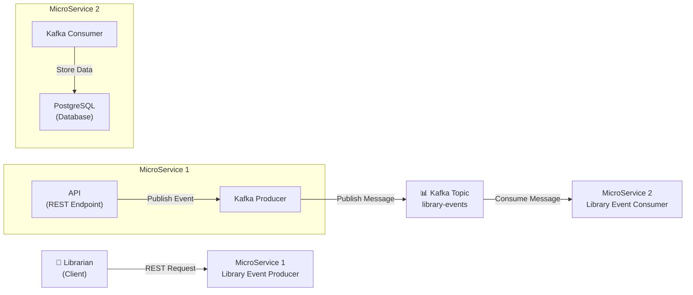

# Library Inventory Architecture

## System Architecture Diagram

## Architecture Components

### 1. **Client Layer**
- **Librarian**: External client/user that initiates requests

### 2. **MicroService 1 - Library Event Producer**
- **API**: REST endpoint to receive library events
  - Accepts POST/PUT requests for library events
  - Validates incoming data
  - Returns responses to client
  
- **Kafka Producer**: 
  - Publishes validated events to Kafka topic
  - Ensures message delivery to the topic

### 3. **Message Broker**
- **Kafka Topic (library-events)**:
  - Central message hub for event distribution
  - Decouples producer and consumer services
  - Ensures asynchronous communication

### 4. **MicroService 2 - Library Event Consumer**
- **Kafka Consumer**: 
  - Subscribes to library-events topic
  - Receives published events
  - Processes events asynchronously
  
- **PostgreSQL Database**:
  - Stores processed library events
  - Maintains data persistence
  - Supports queries on stored events

## Data Flow

1. **Librarian** sends a REST request to **MicroService 1**
2. **API** receives and validates the request
3. **Kafka Producer** publishes the validated event to the **library-events** topic
4. **Kafka Consumer** (MicroService 2) receives the message from the topic
5. **PostgreSQL** stores the processed event data

## Key Benefits

- **Decoupling**: Services communicate through Kafka, not directly
- **Asynchronous Processing**: Producer doesn't wait for consumer response
- **Scalability**: Multiple consumers can subscribe to the same topic
- **Reliability**: Message broker ensures no data loss
- **Data Persistence**: PostgreSQL provides permanent storage

## Technology Stack

| Component | Technology |
|-----------|-----------|
| API Framework | Spring Boot |
| Message Broker | Apache Kafka |
| Database | PostgreSQL |
| Serialization | JSON |

